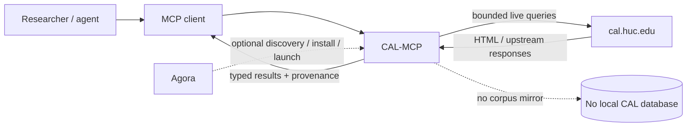
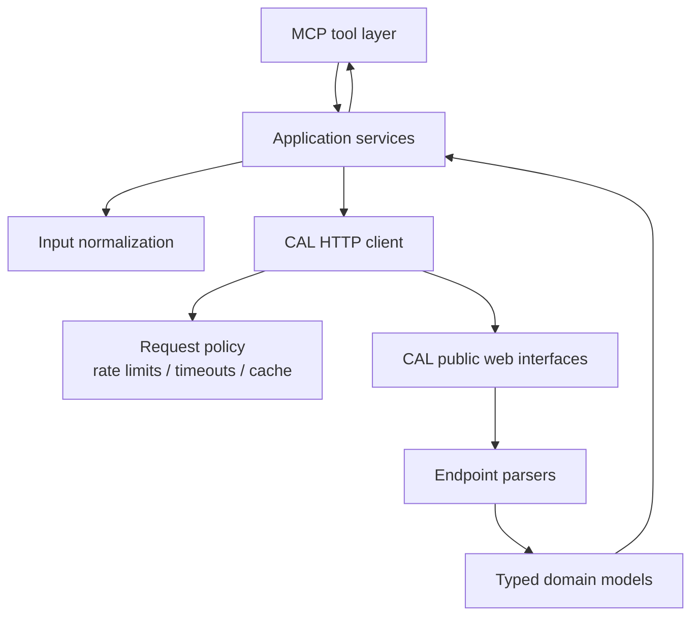

# CAL-MCP

An independent, read-only Model Context Protocol (MCP) adapter for the [Comprehensive Aramaic Lexicon (CAL)](https://cal.huc.edu/).

> **Status:** active pre-release development. The repository includes the first CAL-backed scholarly MCP tool, `cal_lexicon_lookup`; no versioned release has been published yet.

CAL-MCP makes CAL's existing scholarly interfaces easier to use from agents and MCP clients without copying, mirroring, or redistributing the CAL database. Queries remain live, user-initiated requests to CAL; CAL remains the authority for lexical data, texts, citations, bibliography, and scholarly interpretation.

This project is not affiliated with or endorsed by the Comprehensive Aramaic Lexicon Project or Hebrew Union College.

## Goals

- Provide a small, stable, typed MCP interface over CAL's existing public research functions.
- Preserve CAL semantics rather than reinterpret or repair CAL data.
- Accept practical Aramaic inputs (CAL transliteration, Unicode transliteration, Hebrew square script, and Syriac where CAL supports them) and handle them deterministically for CAL queries.
- Return source URLs, retrieval timestamps, CAL identifiers/coordinates when available, and enough provenance for reproducible scholarly use.
- Work as a standalone MCP server with no dependency on Agora.
- Be easy for [Agora](https://github.com/alexsosn/Agora) to discover, install, launch, and describe as a thin third-party plugin.
- Keep automated access conservative: bounded concurrency, no corpus-wide crawl, no background extraction, and no bundled CAL data.

## Non-goals

- Reconstructing or mirroring the CAL database.
- Bulk harvesting CAL content.
- Correcting CAL lexical analyses, morphology, citations, or textual data.
- Adding AI-generated linguistic analyses and presenting them as CAL results.
- Making Agora responsible for CAL-specific behavior.
- Depending on Agora at runtime.

## MCP surface

The public surface is introduced incrementally and stabilized by tests before release.

| Area | Status | Capability |
| --- | --- | --- |
| Lexicon | **Implemented** | `cal_lexicon_lookup`: root/headword/form lookup, explicit homograph disambiguation, complete entry parsing with provenance |
| Input handling | **Implemented** | deterministic CAL/Unicode/Hebrew/Syriac normalization and query encoding |
| English search | Planned | gloss search; citation-text search |
| Concordance | Planned | KWIC/concordance queries with text/dialect constraints supported by CAL |
| Texts | Planned | text catalogue/search; passage/context retrieval |
| Token analysis | Planned | CAL lexical analysis for a token at a CAL text coordinate |
| Citations | Planned | citation lookup, source links, retrieval metadata |
| Bibliography | Planned | bibliographic search where the public CAL interface supports it |
| Targum | Planned | CAL Targum comparison/research operations |
| Syriac | Planned | CAL Syriac research operations |

The server distinguishes between **CAL data returned by the upstream service** and **adapter metadata produced by CAL-MCP**.

See [`docs/tools/lexicon.md`](docs/tools/lexicon.md) for the implemented lexicon contract.

## System boundary



CAL-MCP is independently runnable. Agora integration is downstream packaging and marketplace metadata, not part of the server's domain logic.

## Internal architecture



The MCP tool layer does not parse CAL HTML directly. Endpoint-specific parsing stays behind typed services so CAL markup changes can be handled without changing public MCP contracts unnecessarily.

## Documentation map

The repository uses documentation as executable project state for humans and coding agents:

- [`research.md`](research.md) — dated evidence about CAL, its public interfaces, access assumptions, and prior art.
- [`plan.md`](plan.md) — staged implementation plan and ticket dependency graph.
- [`AGENTS.md`](AGENTS.md) — mandatory entry point and invariants for coding agents.
- [`wiki/README.md`](wiki/README.md) — maintainer documentation index.
- [`wiki/architecture.md`](wiki/architecture.md) — system/component/data-flow architecture and boundaries.
- [`wiki/documentation.md`](wiki/documentation.md) — documentation information architecture, ownership, generation, and validation plan.
- [`wiki/testing.md`](wiki/testing.md) — TDD, fixtures, parser contracts, live-smoke policy, and MCP contract tests.
- [`wiki/decisions.md`](wiki/decisions.md) — durable architecture decisions.
- [`wiki/backlog.md`](wiki/backlog.md) — issue map and release gates.
- [`wiki/agentic-dev-loop.md`](wiki/agentic-dev-loop.md) — exact issue → implementation → review → merge loop.
- [`docs/configuration.md`](docs/configuration.md) — implemented CAL HTTP/request/cache policy and conservative defaults.
- [`docs/concepts/input-and-transliteration.md`](docs/concepts/input-and-transliteration.md) — deterministic input detection, limited CAL-code mapping, and query/form encoding.
- [`docs/tools/lexicon.md`](docs/tools/lexicon.md) — `cal_lexicon_lookup` semantics, examples, limits, failures, and CAL provenance.

Additional user-facing reference documentation under `docs/` is introduced alongside the corresponding implemented behavior so it cannot get ahead of the executable interface. Its target structure is specified in `wiki/documentation.md`.

## Current development state

The repository currently has:

- a standalone stdio MCP server;
- a bounded CAL HTTP/request-policy layer with strict origin, redirect, retry, concurrency, cache, and response-size controls;
- deterministic input normalization/query encoding;
- the live `cal_lexicon_lookup` tool with typed lexicon parsing and provenance;
- offline parser fixtures and deterministic MCP/request-policy tests.

Requirements: Python 3.11+.

```bash
python -m pip install -e ".[dev]"
```

Run the local stdio server:

```bash
cal-mcp
```

The equivalent module entry point is:

```bash
python -m cal_mcp
```

Run the deterministic development checks:

```bash
ruff check .
ruff format --check .
mypy
pytest
```

Importing `cal_mcp.server` remains network-free. When the MCP server starts, its lifespan creates one bounded CAL client for that running server without issuing a CAL request; live traffic begins only when a CAL-backed tool is called. Reusing that client preserves the request layer's process/session-local cache and single-flight behavior across tool calls, and the client is closed at server shutdown. The installed stdio entry point is tested separately. Normal HTTP, normalization, lexicon parser/service, and MCP contract tests make no live CAL requests.

## Development model

Development is issue-driven and test-driven:

1. Pick one unblocked GitHub issue with explicit acceptance criteria.
2. Check that no active PR already implements it.
3. Add or update a failing test/fixture that captures the required behavior.
4. Implement the smallest correct change.
5. Run deterministic tests with normal CI network access disabled.
6. Update interface/architecture/research documentation when required.
7. Open a focused PR linked to the issue.
8. Review independently against the issue, repository invariants, and upstream CAL evidence.
9. Merge only when acceptance criteria, tests, and documentation are complete.

See [`AGENTS.md`](AGENTS.md) and [`wiki/agentic-dev-loop.md`](wiki/agentic-dev-loop.md).

## Upstream and access policy

CAL describes itself as a live work in progress and asks scholarly users to cite the retrieval date. CAL exposes public research forms and server-side query endpoints, but as of the research snapshot documented in this repository we have not found a published CAL API contract or a CAL-specific automated-access policy.

CAL-MCP therefore uses a deliberately narrow operational rule: perform only bounded requests required to answer the user's current MCP call; do not crawl, mirror, prefetch the corpus, or redistribute CAL content. If CAL publishes a machine API or explicit automation policy, `research.md` and the relevant architecture decision must be updated before changing behavior.

## License

CAL-MCP software and repository documentation are licensed under the MIT License. This license does **not** grant rights to CAL data, CAL website content, underlying text editions, or third-party dictionaries. Those remain governed by their respective owners and upstream terms.
