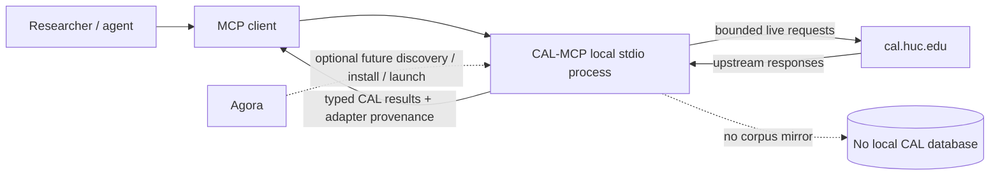

# CAL-MCP

An independent, read-only Model Context Protocol (MCP) adapter for the [Comprehensive Aramaic Lexicon (CAL)](https://cal.huc.edu/).

> **Status:** active pre-release development. The current v0.1 candidate exposes 26 CAL-backed public tools across lexicon, English search, texts, token analysis, concordance/KWIC, bibliography, dictionary collation, external citations, Targum Studies, and Syriac Studies. No versioned release has been published yet.

**User documentation:** start at [`docs/index.md`](docs/index.md) for the dated capability matrix, getting started, tool reference, workflows, provenance/error semantics, and limitations.

CAL-MCP makes CAL's existing scholarly interfaces easier to use from agents and MCP clients without copying, mirroring, or redistributing the CAL database. Queries remain live, user-initiated requests to CAL; CAL remains the authority for lexical data, texts, citations, bibliography, dictionary collation, Targum data, Syriac data, and scholarly interpretation.

This project is not affiliated with or endorsed by the Comprehensive Aramaic Lexicon Project or Hebrew Union College.

## Goals

- Provide a small, stable, typed MCP interface over CAL's public research functions.
- Preserve CAL semantics rather than reinterpret or repair CAL data.
- Accept practical Aramaic inputs using deterministic CAL-supported representation handling.
- Return CAL source URLs, retrieval timestamps, identifiers/coordinates when available, and enough provenance for reproducible scholarly use.
- Work as a standalone stdio MCP server with no dependency on Agora.
- Keep automated access conservative: bounded concurrency/retries/responses, no corpus crawl, no background extraction, no bundled CAL data.

## Non-goals

- Reconstructing, mirroring, or bulk harvesting the CAL database.
- Correcting CAL lexical analyses, morphology, citations, or textual data.
- Adding AI-generated linguistic analyses and presenting them as CAL results.
- Hiding multi-stage research behind automatic result/link traversal.
- Making Agora responsible for CAL-specific behavior or depending on Agora at runtime.

## v0.1 public surface

The executable tool schemas are the technical source of truth. The issue-#12 audit freezes the current 26-tool surface for v0.1 except release-blocking regression fixes.

| Area | Public tools |
| --- | --- |
| Lexicon | `cal_lexicon_lookup` |
| English search | `cal_gloss_search`, `cal_citation_text_search` |
| Texts | `cal_text_catalogue`, `cal_text_search`, `cal_text_page` |
| Token analysis | `cal_token_analysis` |
| Concordance/KWIC | `cal_text_concordance`, `cal_kwic_texts`, `cal_kwic_dialects`, `cal_kwic_dialect` |
| Bibliography | `cal_bibliography_authors`, `cal_bibliography_author`, `cal_bibliography_keyword`, `cal_bibliography_lemma` |
| Dictionary collation | `cal_dictionary_collation` |
| External citations | `cal_external_citation_dialects`, `cal_external_citation_sources`, `cal_external_citations` |
| Targum Studies | `cal_targum_parallel`, `cal_targum_concordance`, `cal_targum_hebrew_lemmas`, `cal_targum_hebrew_reflexes` |
| Syriac Studies | `cal_syriac_texts`, `cal_syriac_missing_words`, `cal_syriac_peshitta_parallel` |

See the [dated capability matrix](docs/index.md#public-capability-matrix) for which current CAL functions are implemented directly, intentionally composed from these tools, or explicitly deferred.

## System boundary



CAL-MCP is independently runnable. Agora integration is downstream packaging/marketplace metadata and is not part of the runtime dependency chain.

## Request and data policy

The shared CAL client enforces finite timeouts, low bounded concurrency, transient-only bounded retries, redirect/origin boundaries, streaming response-size limits, duplicate in-flight request suppression, and a bounded process-local cache. Starting/importing the server does not contact CAL; live traffic begins only when a CAL-backed tool is explicitly called.

Normal CI is offline and uses reduced semantic fixtures. CAL-MCP does not expose cache warming, background refresh, persistent storage, automatic corpus traversal, or a generic invented pagination layer.

See [`docs/configuration.md`](docs/configuration.md), [`docs/concepts/errors-and-upstream-drift.md`](docs/concepts/errors-and-upstream-drift.md), and [`docs/limitations.md`](docs/limitations.md).

## Current pre-release installation

Requirements: Python 3.11+.

From a repository checkout:

```bash
python -m pip install -e ".[dev]"
```

Run the stdio server:

```bash
cal-mcp
```

Equivalent module entry point:

```bash
python -m cal_mcp
```

No stable package-index/release command is documented yet; issue #15 owns the published v0.1 release gate. See [`docs/installation.md`](docs/installation.md) and [`docs/integrations/standalone-mcp.md`](docs/integrations/standalone-mcp.md).

## Development checks

```bash
ruff check .
ruff format --check .
mypy
pytest
```

Development is issue-driven and test-driven. New behavior requires current-source research where relevant, a committed plan, deterministic RED before implementation, full offline GREEN, user/architecture documentation, and a logically independent adversarial review of the exact final PR head before guarded merge.

See [`AGENTS.md`](AGENTS.md) and [`wiki/agentic-dev-loop.md`](wiki/agentic-dev-loop.md).

## Maintainer documentation

- [`research.md`](research.md) — dated cross-project upstream evidence.
- [`plan.md`](plan.md) — staged implementation/release plan.
- [`wiki/README.md`](wiki/README.md) — maintainer documentation index.
- [`wiki/architecture.md`](wiki/architecture.md) — actual system/component/request architecture.
- [`wiki/testing.md`](wiki/testing.md) — TDD, fixtures, CI, and live-smoke policy.
- [`wiki/documentation.md`](wiki/documentation.md) — user/maintainer documentation ownership and executable docs contract.
- [`wiki/decisions.md`](wiki/decisions.md) — durable architecture decisions.
- [`wiki/backlog.md`](wiki/backlog.md) — issue/release map.

Focused issue research/plans live under `docs/research/` and `docs/plans/` when a ticket requires a frozen evidence/execution artifact.

## Upstream and access policy

CAL describes itself as a live work in progress and asks scholarly users to cite retrieval dates. CAL exposes public research forms and server-side query handlers, but the project has not found a published CAL machine API contract or CAL-specific automated-access policy.

CAL-MCP therefore follows a deliberately narrow engineering policy: only bounded requests attributable to the current user/MCP operation; no crawl, mirror, prefetch, corpus extraction, or data redistribution. If CAL publishes explicit machine guidance, the research/architecture decisions must be updated before request behavior changes materially.

## License

CAL-MCP software and repository documentation are licensed under the MIT License. This license does **not** grant rights to CAL data, CAL website content, underlying text editions, or third-party dictionaries. Those remain governed by their respective owners and upstream terms.