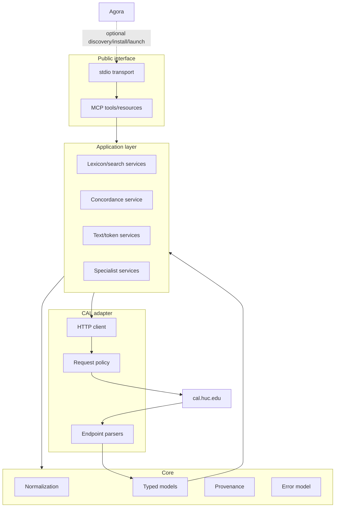
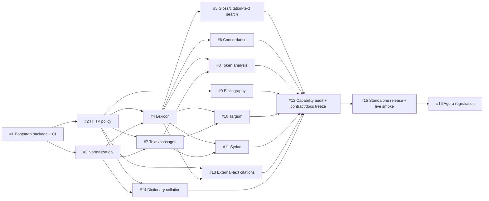

# CAL-MCP implementation plan

**Plan date:** 2026-09-03

This plan turns the research findings into small, reviewable GitHub issues. CAL-MCP is standalone-first: it must be fully usable as a normal MCP server before Agora registration. Agora integration is downstream marketplace/launch metadata over a released package.

## Delivery principles

1. **Thin adapter.** Query CAL live for explicit user operations; do not build a local CAL database.
2. **Stable public contract, unstable private adapters.** MCP schemas must not expose CAL HTML/form layout.
3. **TDD by upstream surface.** Each parser begins with a minimal dated fixture and failing tests.
4. **Offline deterministic CI.** Normal CI never depends on CAL availability.
5. **Low-load live verification.** Live checks are opt-in/scheduled and strictly request-capped.
6. **Provenance everywhere.** CAL source URL and retrieval timestamp are part of CAL-backed results.
7. **Standalone before Agora.** Package, entry point, tools, docs, and CAL-specific guidance live here.
8. **Documentation ships with behavior.** A tool is incomplete until its user-facing reference/examples are updated.
9. **Coverage is audited, not assumed.** Before v0.1 freeze, every current CAL public research function must be implemented, intentionally composed from existing tools, or explicitly deferred with a documented reason.

## Target component architecture



## Dependency graph



Independent branches may proceed in parallel once prerequisites merge, but agents must check for overlapping active PRs first.

## Phase 0 — Repository/bootstrap

### #1 — Bootstrap Python package, MCP server shell, CI, and development tooling

- `src/cal_mcp/` package and stable stdio entry point;
- reproducible install/dev commands;
- formatting/lint/type/test setup;
- deterministic network-independent CI;
- server startup/introspection test proving zero CAL requests;
- version exposure suitable for later pinning.

No CAL domain query belongs in #1.

## Phase 1 — Core adapter infrastructure

### #2 — CAL HTTP client and conservative request policy

- finite timeouts;
- bounded transient retries/backoff;
- low concurrency;
- honest project identification where appropriate;
- bounded optional cache with cache-off mode;
- typed network/upstream/content errors;
- tests against retry storms, hidden prefetching, and unbounded behavior.

### #3 — Deterministic CAL input normalization/query encoding

- explicit/deterministic representation handling;
- CAL transliteration, Hebrew, Syriac, and justified Unicode transliteration support;
- safe query/form encoding;
- preserve original + normalized query;
- explicit lossy/ambiguous/unsupported cases;
- no LLM normalization.

Prefer sending representations CAL itself accepts directly instead of gratuitous transliteration.

## Phase 2 — Core research functionality

### #4 — Lexicon lookup and complete entry parsing

First end-to-end scholarly capability:

- root/canonical/full-form lookup where current CAL supports it;
- typed lemma/entry/sense/dialect/form/derivative/citation structures needed for fidelity;
- provenance and not-found/upstream-drift distinction;
- minimal fixtures for current browse/entry surfaces;
- MCP tool reference and examples.

### #5 — English gloss and citation-text search

- reverse English gloss search;
- search combinations/terms in CAL citations as supported upstream;
- typed bounded result references;
- explicit page/continuation semantics;
- no local semantic search/reranking.

### #6 — Concordance/KWIC

- single-text concordance;
- multi-text/dialect KWIC where currently supported;
- typed context/source hits;
- explicit bounded traversal;
- preserve CAL text/dialect terminology.

### #7 — Text catalogue/search and passage/context retrieval

- bounded text discovery;
- requested page/passage/context retrieval;
- CAL text/file identifiers and coordinates;
- line/coordinate preservation;
- navigation needed by token analysis and specialist modules;
- no full text export/mirror.

### #8 — Token-at-coordinate lexical analysis

- typed wrapper around CAL's coordinate/token workflow (`getlex.php` or current equivalent);
- no guessed coordinate or arbitrary-text morphological analyzer;
- preserve multiple CAL analyses;
- compose with shared lexicon references.

## Phase 3 — Additional CAL scholarly surfaces

### #9 — Bibliographic search

- document current author/keyword/lemma bibliography query contract;
- typed results and provenance;
- explicit bounded continuation;
- no local bibliography index.

### #10 — Targum Studies module

- first inventory the current Targum module in `research.md`;
- implement the smallest faithful research-oriented MCP surface;
- preserve version/source distinctions;
- reuse generic text/lexicon models only where semantics are truly shared.

### #11 — Syriac Studies module

- first inventory current Syriac operations;
- implement faithful specialist coverage;
- support Syriac script directly where CAL supports it;
- keep CAL results distinct from SEDRA or other Syriac services.

### #13 — Citations from texts outside the online CAL corpus

CAL lists this separately from ordinary text browsing/search.

- document current form/result contract;
- model references without pretending the absent source text is retrievable through CAL;
- preserve source/lemma/bibliographic links where available;
- bounded search only.

### #14 — Dictionary Spelling Collation

- document current collation inputs/source selectors/result structure;
- preserve dictionary/source distinctions;
- expose CAL's collation without inventing a fuzzy matcher;
- no local copies/indexing of third-party dictionaries.

## Phase 4 — Coverage audit, public contract, documentation

### #12 — Stabilize public MCP contract and complete v0.1 documentation

Before freezing v0.1:

1. build a dated capability matrix from CAL's current search page, FAQ/new-user guide, Targum module, and Syriac module;
2. account for **every current public research function** as implemented, intentionally composed from other tools, or explicitly deferred with a documented decision;
3. open focused prerequisite issues for any real coverage gap rather than implementing it opportunistically inside #12;
4. review tool names/parameters/result models for composability and redundancy;
5. finalize common provenance, errors, and pagination conventions;
6. complete the versioned `docs/` information architecture;
7. mechanically check tool docs against executable schemas where practical;
8. validate examples from tests/fixtures;
9. re-check architectural diagrams against the implementation.

This is the public-contract freeze gate for `0.1.0`.

## Phase 5 — Standalone release and Agora

### #15 — Publish v0.1 and add low-load live drift smoke tests

- clean-build/install release artifact;
- versioned changelog/release notes;
- standalone stdio launch verified from a clean environment;
- tiny opt-in/scheduled live smoke suite with a strict total request cap;
- distinguish CAL downtime/network failure from parser drift where practical;
- document exact package/version/entry point for downstream consumers.

### #16 — Register released CAL-MCP with Agora

Prerequisite: published standalone release from #15.

CAL-MCP side:

- authoritative released capability description;
- exact package/version/entry point;
- one representative low-load smoke operation;
- optional Agora user guide.

Downstream Agora side:

- local Python MCP process;
- `data_mode: remote`;
- pin released CAL-MCP rather than vendor/fork it;
- stdio launch metadata;
- software license from CAL-MCP;
- CAL data/service terms remain upstream-dependent;
- capabilities only for released tools;
- smoke-level integration evidence only;
- no CAL parsing, normalization, or semantic bug fixes in Agora.

## Documentation workstream

`wiki/documentation.md` is the documentation design source. User pages are added with implemented behavior rather than as empty placeholders.

Planned v0.1 tree:

```text
docs/
├── index.md
├── getting-started.md
├── installation.md
├── configuration.md
├── concepts/
│   ├── cal-identifiers.md
│   ├── input-and-transliteration.md
│   ├── provenance-and-citation.md
│   └── errors-and-upstream-drift.md
├── tools/
│   ├── lexicon.md
│   ├── search.md
│   ├── concordance.md
│   ├── texts.md
│   ├── token-analysis.md
│   ├── bibliography.md
│   ├── dictionary-collation.md
│   ├── targum.md
│   └── syriac.md
├── guides/
│   ├── lexical-research.md
│   ├── corpus-context.md
│   └── reproducible-citations.md
├── integrations/
│   ├── standalone-mcp.md
│   └── agora.md
└── limitations.md
```

Executable MCP schemas are the technical source of truth. Human docs explain CAL terminology, tool selection, semantics, examples, provenance, limits, and upstream-dependent failures. They should not maintain a divergent hand-copied schema.

## v0.1 release gates

`0.1.0` is ready only when:

- the current CAL public-capability matrix is complete and all functions are accounted for;
- core lexical lookup, search, concordance, text retrieval, and token analysis are functional;
- bibliography, external-text citation lookup, dictionary collation, Targum, and Syriac scope are implemented or explicitly deferred by a reviewed decision;
- deterministic CI is green with CAL network access unavailable;
- live smoke passes within strict request caps;
- public tool schemas are independently reviewed and frozen;
- standalone install/stdio launch works from a clean environment;
- provenance is present on every CAL-backed result;
- docs match the released interface and examples are reproducible;
- no CAL database/content is bundled or bulk-captured;
- Agora can pin the release without importing CAL-specific code into Agora.
