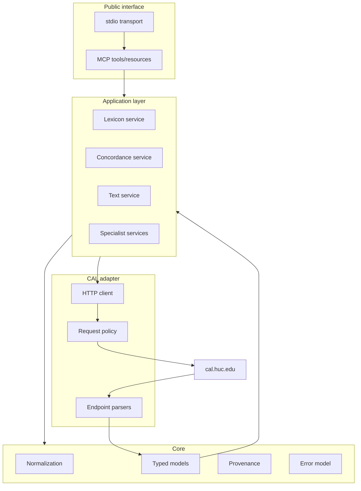
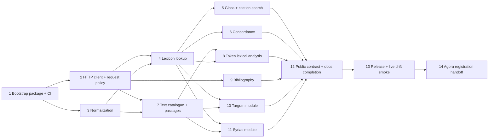

# CAL-MCP implementation plan

**Plan date:** 2026-09-03

This plan turns the research findings into a sequence of small, reviewable issues. The implementation is deliberately standalone-first: CAL-MCP must be fully usable as a normal MCP server before Agora registration. Agora integration is a downstream release task.

## Delivery principles

1. **Thin adapter.** Query CAL live and return structured CAL results. Do not build a local lexical database.
2. **Stable public contract, unstable private adapters.** MCP schemas should not expose CAL's HTML layout.
3. **TDD by upstream surface.** Each parser starts from a minimal dated fixture and failing tests.
4. **Offline deterministic CI.** Normal CI never depends on CAL availability.
5. **Low-load live verification.** Live tests are opt-in/scheduled and perform only a few representative queries.
6. **Provenance everywhere.** Source URL and retrieval timestamp are part of result schemas.
7. **Standalone before Agora.** Package/entry point and docs must work without Agora. Agora only consumes the released interface.
8. **Documentation ships with behavior.** No tool is complete until its user-facing reference and examples are committed in the same PR.

## Target component architecture



## Dependency graph



The graph shows logical dependencies. Independent branches such as bibliography and text browsing may proceed in parallel once their prerequisites are merged, but an agent must still check for overlapping active PRs.

## Phase 0 — Repository/bootstrap

### Ticket 1 — Bootstrap Python package, MCP server shell, CI, and development tooling

Deliverables:

- `src/cal_mcp/` package with a minimal server entry point;
- project metadata and reproducible local installation;
- formatting/lint/type/test commands documented;
- deterministic CI with network-disabled tests;
- one MCP introspection/health-style contract test proving the server starts without contacting CAL;
- version exposure suitable for downstream Agora pinning.

No CAL domain query belongs in this ticket.

## Phase 1 — Core adapter infrastructure

### Ticket 2 — Implement CAL HTTP client and conservative request policy

Deliverables:

- one HTTP client abstraction;
- finite timeouts;
- bounded retries for transient failures only;
- explicit CAL-MCP User-Agent/project identification where appropriate;
- low default concurrency;
- bounded optional cache interface with cache-off mode;
- typed network/upstream error classes;
- tests proving no accidental retry storms or hidden prefetching.

### Ticket 3 — Implement deterministic CAL input normalization

Deliverables:

- representation detection/explicit representation parameter;
- deterministic conversion needed for CAL queries;
- CAL ASCII/query encoding utilities;
- preservation of original and normalized query strings;
- Unicode/script edge-case tests;
- no LLM dependency.

The implementation should prefer calling CAL's own accepted representations directly where that is more faithful than transliterating locally.

## Phase 2 — Core research functionality

### Ticket 4 — Lexicon lookup and complete entry parsing

First end-to-end scholarly capability.

Deliverables:

- lookup by a CAL-supported lemma/root/form input;
- typed `LexiconEntry`, lemma reference, sense/dialect/form/derivative structures where recoverable;
- stable provenance object;
- explicit empty/not-found/upstream-changed behavior;
- minimal fixtures from `browseSKEYheaders.php`, `cal_entry_web.php`, and/or `oneentry.php` as required;
- MCP tool schemas and user docs.

### Ticket 5 — English gloss and citation-text search

Deliverables:

- reverse English gloss search;
- citation-text search functions demonstrably supported by CAL;
- typed result references that can be followed into lexicon entries/citations;
- pagination/limit semantics that reflect CAL rather than simulating corpus-wide search;
- tool docs and examples.

### Ticket 6 — Concordance/KWIC queries

Deliverables:

- basic concordance for one text where CAL exposes it;
- multi-text/dialect KWIC where current public forms support it;
- typed `ConcordanceHit` with context, source reference, and provenance;
- explicit result limiting/pagination;
- no automatic expansion into bulk corpus extraction;
- docs explaining CAL dialect/text constraints rather than inventing a new query language.

### Ticket 7 — Text catalogue, text search, and passage/context retrieval

Deliverables:

- enumerate/search CAL's public text catalogue in a bounded manner;
- retrieve a requested text page/passage/context;
- model CAL text/file identifiers and coordinates explicitly;
- preserve line/coordinate metadata;
- support navigation required by later token analysis and specialist modules;
- docs with reproducible examples.

### Ticket 8 — Token-at-coordinate lexical analysis

Deliverables:

- typed wrapper around CAL's text-coordinate lexical-analysis workflow (`getlex.php` or current equivalent);
- explicit token/coordinate parameters;
- zero heuristic guessing when the coordinate is absent;
- links to parsed lexical entries when CAL supplies them;
- tests for ambiguous/multiple analyses and missing coordinates.

## Phase 3 — Additional CAL scholarly surfaces

### Ticket 9 — Bibliographic search

Deliverables:

- document the public bibliography query contract;
- implement author/keyword/lemma searches actually supported upstream;
- typed bibliographic result with upstream identifiers/links;
- no bibliographic scraping/indexing beyond the current user query.

### Ticket 10 — Targum studies module

Deliverables:

- inventory current CAL Targum operations;
- design the minimum faithful set of specialist MCP tools;
- implement parallel-verse/comparison and related lexical operations supported by CAL;
- preserve version/source labels exactly;
- document limitations and upstream terminology.

Do not generalize Targum-specific semantics into generic passage tools if doing so loses information.

### Ticket 11 — Syriac studies module

Deliverables:

- inventory current CAL Syriac operations;
- implement the faithful specialist subset necessary for practical CAL feature coverage;
- support Syriac input without forcing agents through CAL ASCII where avoidable;
- keep CAL results distinct from SEDRA or other Syriac services.

## Phase 4 — Contract stabilization, documentation, and release

### Ticket 12 — Stabilize the public MCP contract and complete user documentation

Deliverables:

- review all tool names/parameters/result models for composability and redundancy;
- common pagination/limit conventions where CAL semantics allow them;
- common `Provenance` and typed error schema;
- complete `docs/` information architecture described in `wiki/documentation.md`;
- standalone installation/configuration guides;
- tool reference generated or mechanically checked against actual MCP schemas where practical;
- end-to-end examples for lexicon, concordance, text/token, Targum, and Syriac workflows;
- explicit data-rights/access/load documentation;
- architecture diagrams kept current.

This is the public-contract freeze gate for `0.1.0`.

### Ticket 13 — Package release and low-load live drift detection

Deliverables:

- publish/installable release artifact;
- versioned changelog/release notes;
- small opt-in/scheduled live smoke suite that performs representative CAL queries with strict request caps;
- drift alerts distinguish CAL unavailability from parser/schema breakage;
- standalone stdio launch instructions validated from a clean environment.

### Ticket 14 — Prepare and submit Agora registration

Prerequisite: a released standalone CAL-MCP version.

Deliverables in CAL-MCP:

- document exact package/version/entry point Agora should pin;
- expose authoritative upstream capability descriptions here;
- provide a minimal representative smoke query for Agora integration testing;
- prepare a downstream Agora PR that only adds discovery/install/launch/compatibility metadata and smoke-level integration evidence;
- no CAL parser, linguistic behavior, or CAL-specific repair logic in Agora.

Expected Agora shape based on its current registry architecture:

- local Python MCP process;
- remote data mode;
- pinned released `cal-mcp` package/entry point;
- stdio launch for clients that support local MCP;
- software license: CAL-MCP's license;
- data/service terms: upstream-dependent;
- capabilities derived from the released MCP surface, not aspirational backlog items.

## Documentation workstream

Documentation is not deferred to the end. `wiki/documentation.md` defines the information architecture; implementation tickets create the corresponding `docs/` page together with each feature.

Planned user-facing tree at v0.1:

```text
docs/
├── index.md
├── getting-started.md
├── installation.md
├── configuration.md
├── concepts/
│   ├── cal-identifiers.md
│   ├── input-and-transliteration.md
│   ├── provenance-and-citation.md
│   └── errors-and-upstream-drift.md
├── tools/
│   ├── lexicon.md
│   ├── search.md
│   ├── concordance.md
│   ├── texts.md
│   ├── token-analysis.md
│   ├── bibliography.md
│   ├── targum.md
│   └── syriac.md
├── guides/
│   ├── lexical-research.md
│   ├── corpus-context.md
│   └── reproducible-citations.md
├── integrations/
│   ├── standalone-mcp.md
│   └── agora.md
└── limitations.md
```

The source of truth for tool parameters is executable MCP schema/code. Human reference pages explain semantics, CAL terminology, examples, limitations, provenance, and request behavior. They must not maintain a second manually divergent copy of schemas when generation/checking is practical.

## v0.1 release gates

`0.1.0` is ready only when:

- core lexical lookup, search, concordance, text retrieval, and token analysis are functional;
- specialist Targum/Syriac coverage defined for v0.1 is implemented or explicitly re-scoped with a documented decision;
- deterministic CI is green with CAL network access disabled;
- live smoke checks pass within strict request caps;
- public tool schemas are reviewed and frozen for the release;
- standalone installation and stdio launch are tested from a clean environment;
- provenance is present on all CAL-backed results;
- docs match the released interface;
- no CAL content/database is bundled;
- Agora integration can pin the release without importing CAL-specific code into Agora.
