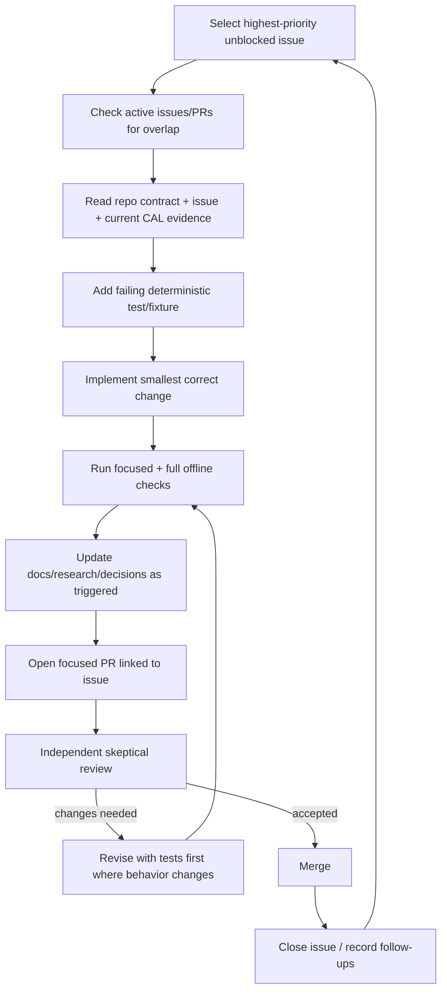
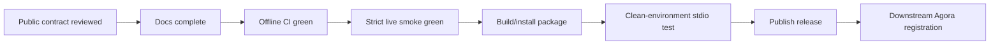

# Automatic agentic development loop

This repository is meant to support repeated implementation/review cycles without relying on a long-lived chat session. GitHub issues, PRs, tests, and repository documentation are the persistent state.

## 1. Loop overview

## 2. Selecting work

An implementation agent should:

1. read `AGENTS.md` and the wiki index;
2. inspect open issues ordered by release dependency/priority;
3. choose an issue whose dependencies are closed/merged;
4. search open PRs and issues for overlapping work;
5. avoid starting a second implementation of the same upstream surface.

If the highest-priority issue is blocked by unknown CAL behavior, the agent may perform the bounded research explicitly required by that issue and update `research.md`. It must not broaden the task into a corpus audit.

## 3. Issue contract

Every implementation issue should contain:

- problem/research capability;
- scope;
- explicit non-goals;
- dependencies;
- acceptance criteria;
- test requirements;
- documentation impact;
- CAL access/load constraints when network behavior is involved;
- references to current upstream evidence.

An issue is the unit of intent. A PR is the unit of change.

## 4. TDD execution

### Red

Create the smallest failing test that demonstrates the missing behavior. For CAL parsers, capture only the minimal upstream structural fragment required and record its source/capture date.

### Green

Implement only enough production code to satisfy the issue and tests. Avoid speculative abstractions for later CAL surfaces.

### Refactor

Refactor after green while preserving the public contract and passing tests. Shared parsing primitives should be extracted only when at least two concrete surfaces demonstrate the common behavior.

## 5. CAL-specific upstream check

Before implementing a ticket that depends on a current CAL form/page:

- open the exact public CAL surface;
- verify the form/links/parameters assumed by `research.md` are still present;
- record changed evidence before coding if assumptions differ;
- make no more live requests than needed to understand the issue.

Do not enumerate all lemmas, texts, pages, or dialect combinations for “research completeness.”

## 6. PR construction

A PR should normally implement one issue.

PR body must state:

- issue closed/addressed;
- behavior added/changed;
- failing test/fixture established before implementation;
- tests run;
- CAL pages/request patterns touched;
- expected request-volume impact;
- data/provenance implications;
- docs updated;
- known limitations/follow-ups.

Large PRs spanning independent CAL surfaces should be split unless the issue demonstrates an inseparable contract change.

## 7. Independent review

The review agent should not assume the implementation agent's design is correct. Review from the issue and repository invariants.

### Required review questions

- Does it satisfy exactly the issue acceptance criteria?
- Does it preserve CAL semantics instead of inventing/repairing them?
- Can one user call trigger unexpectedly many CAL requests?
- Is pagination bounded?
- Are retries/concurrency/cache behavior safe?
- Does the parser silently drop meaningful upstream fields?
- Are not-found, upstream-error, maintenance-page, and markup-drift cases distinguishable?
- Are Hebrew/Syriac/transliteration paths deterministic?
- Is provenance attached consistently?
- Did the public MCP schema unnecessarily expose a CAL HTML/form detail?
- Does it work standalone without Agora?
- Did any CAL-specific logic leak into a planned Agora integration?
- Are user docs synchronized with actual tool behavior?

### Review outcome

- **Approve** only if acceptance criteria and definition of done are met.
- **Request changes** for correctness, contract, load, provenance, tests, or documentation gaps.
- Create separate issues for worthwhile unrelated improvements rather than expanding the PR indefinitely.

## 8. Merge and handoff

After merge:

1. close the issue if not auto-closed;
2. update dependent issues only if assumptions changed;
3. create a focused follow-up issue for discovered out-of-scope work;
4. ensure `research.md`/decisions reflect any new durable evidence;
5. next agent resumes from repository/issue state, not the prior conversation.

## 9. Failure and pause states

When work cannot proceed, leave explicit state in the issue/PR.

Examples:

- `BLOCKED_UPSTREAM_CHANGE` — CAL surface changed and needs research/design update;
- `BLOCKED_DEPENDENCY` — prerequisite issue/PR not merged;
- `BLOCKED_RELEASE` — waiting for a package/release artifact required by downstream integration;
- `NEEDS_REVIEW` — implementation complete, independent review required;
- `NEEDS_REVISION` — review identified required changes.

These may be labels later; the semantic state must at minimum be written in the issue/PR so another agent can resume.

## 10. Network discipline for agents

During development/research:

- prefer saved minimal fixtures after one necessary upstream observation;
- do not repeatedly hit CAL to rerun deterministic parser tests;
- never write a development loop that polls CAL continuously;
- opt-in live smoke is a separate explicit command/job;
- if CAL returns rate-limit/overload signals, stop live testing and record the evidence rather than retrying aggressively.

## 11. Release loop

Release work has additional gates:

Agora registration never precedes a standalone release suitable for pinning.
