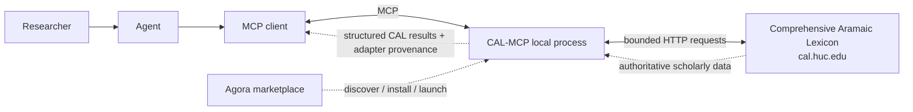
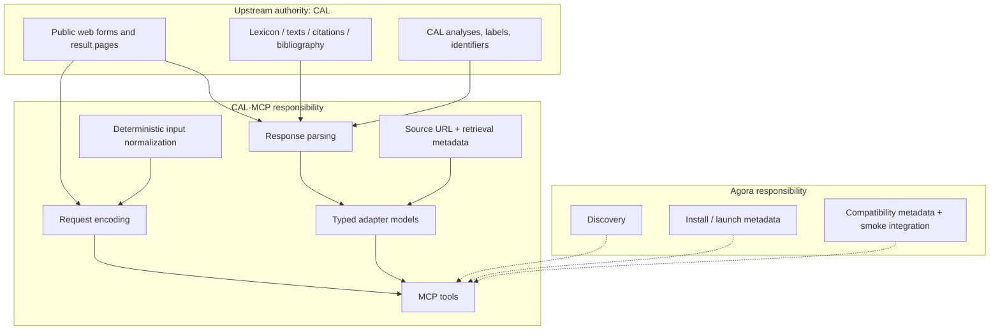
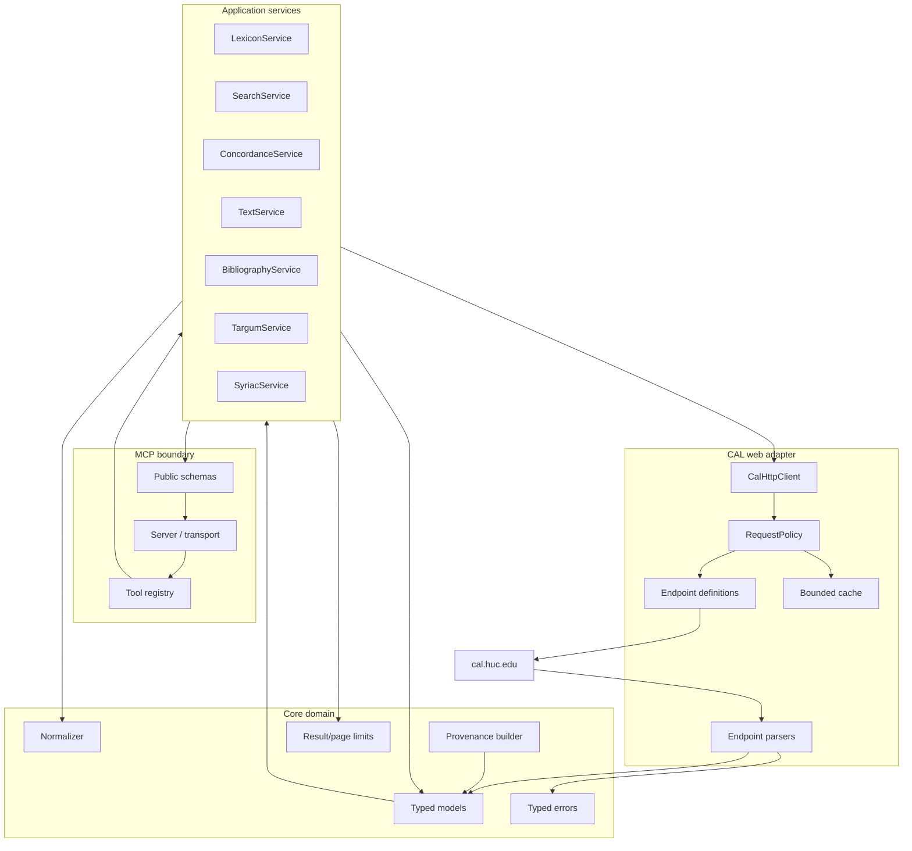
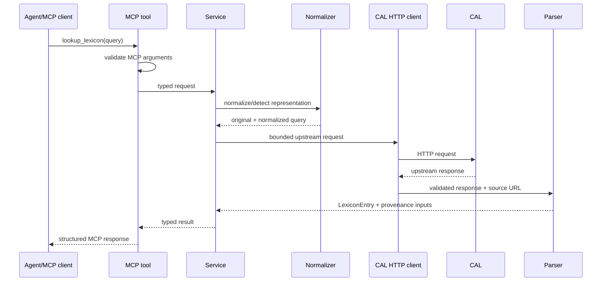
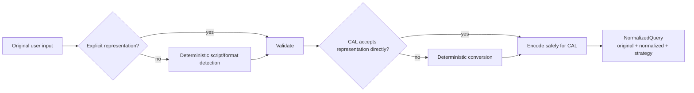
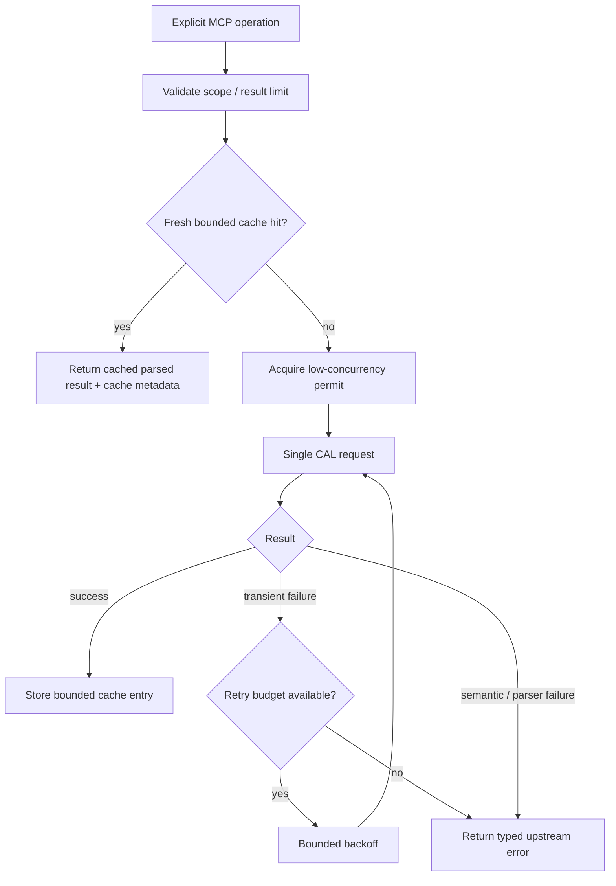
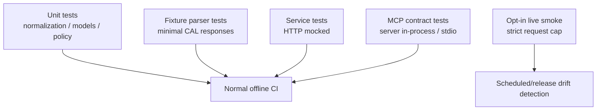
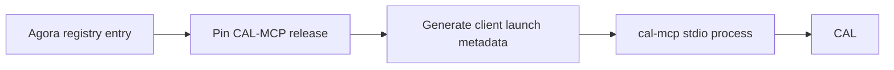

# Architecture

## 1. Architectural objective

CAL-MCP is a local, read-only MCP adapter over the Comprehensive Aramaic Lexicon's existing public research interfaces. It should make CAL easier for agents to query while preserving upstream semantics, identifiers, and provenance.

The design optimizes for five properties:

1. **Standalone operation** — the server runs as a normal MCP package without Agora.
2. **Thin upstream behavior** — no local CAL database, no scholarly reinterpretation, no hidden enrichment.
3. **Stable MCP contract** — CAL HTML and form details remain private adapter implementation details.
4. **Low upstream load** — user-triggered bounded queries, conservative concurrency/retries/cache.
5. **Recoverability** — fixtures, decisions, docs, and issues let another agent resume work without prior conversation context.

## 2. System context



Agora is outside the runtime dependency chain. An Agora-installed CAL-MCP process and a manually installed CAL-MCP process execute the same server.

## 3. Trust and ownership boundaries



### CAL owns

- textual and lexical data;
- lexical analyses, glosses, senses, dialect labels, citations, text coordinates;
- bibliography and specialist Targum/Syriac content;
- changes/corrections to CAL itself.

### CAL-MCP owns

- deterministic query normalization/encoding;
- conservative HTTP behavior;
- mapping CAL responses into typed, loss-aware adapter models;
- MCP tool schemas and composition;
- provenance metadata added by the adapter;
- user-facing documentation for the MCP;
- parser drift detection and error reporting.

### Agora owns

- marketplace discovery and description;
- installation and process launch metadata;
- client compatibility metadata;
- smoke-level proof that the released server can be reached.

CAL parsing, linguistic behavior, and CAL-specific usage guidance must not migrate into Agora merely for convenience.

## 4. Component architecture



### 4.1 MCP boundary

Responsibilities:

- declare tool names, descriptions, arguments, output schemas;
- validate caller input before network access;
- map typed service results/errors into MCP responses;
- own the lifespan of one bounded `CalHttpClient` for the running server so cache and single-flight state are shared across tool calls; client construction performs no CAL request and shutdown closes it;
- remain unaware of selectors, table layout, HTML nesting, or CAL-specific request retry details.

### 4.2 Application services

Services correspond to coherent CAL research tasks, not individual PHP pages. A service may combine a small number of upstream requests when that is required to perform a single explicit user operation, but it must not use hidden expansion/prefetch to simulate a local database.

Examples:

- `LexiconService.lookup()` may normalize a query and retrieve the matching entry.
- `TextService.passage()` may retrieve a requested CAL text page/context.
- `ConcordanceService.kwic()` may submit CAL's current concordance form parameters and parse bounded results.

### 4.3 Core domain

The core contains no networking and no MCP framework dependency. Models should be reusable from tests and alternate transports.

Candidate core types:

```text
Provenance
LemmaRef
LexiconEntry
Sense
Form
DerivativeRef
Citation
TextRef
Passage
Token
TokenAnalysis
ConcordanceHit
BibliographyRef
NormalizedQuery
ResultPage[T]
```

The exact schema is established incrementally by tickets and tests; this list is architectural guidance rather than a frozen API.

### 4.4 CAL web adapter

This is the anti-corruption layer around undocumented upstream web interfaces.

It owns:

- URL/form parameter construction;
- percent encoding and script-safe requests;
- response content-type/status validation;
- maintenance/error-page detection;
- endpoint-specific parsers;
- conversion to typed models;
- parser-specific warnings when representation is partial;
- conservative request policy.

No caller outside this layer should know that a capability currently comes from `cal_entry_web.php`, `getlex.php`, or another specific handler.

## 5. Request flow



Failure at any layer remains distinguishable:

- invalid caller input;
- unsupported/local normalization;
- network timeout;
- upstream HTTP failure;
- CAL not-found/empty result;
- parser schema mismatch/upstream drift;
- result-limit/pagination condition.

Do not collapse these into a generic “no result.”

## 6. Input normalization architecture

Normalization has two purposes:

1. make common user inputs accepted safely by CAL;
2. stop agents from manually inventing CAL ASCII/query syntax.



Rules:

- preserve the original input;
- prefer a representation CAL already accepts directly;
- make lossy/ambiguous conversion explicit;
- never ask an LLM to normalize/query CAL;
- do not silently choose among multiple linguistic analyses.

## 7. Response model and provenance

All CAL-backed top-level results should carry a common provenance structure. A likely shape is:

```json
{
  "source": "CAL",
  "source_url": "https://cal.huc.edu/...",
  "retrieved_at": "2026-09-03T20:00:00Z",
  "upstream_id": "...",
  "query": {
    "original": "...",
    "normalized": "...",
    "strategy": "..."
  }
}
```

Fields are optional when the upstream surface does not provide them, except `source`, `source_url`, and `retrieved_at` for a successful CAL-backed network result.

### Loss-awareness

If CAL exposes information the typed model does not yet represent, the parser must not silently discard material semantic fields. The correct behavior depends on scope:

- extend the model when the field is part of the ticket's required semantics;
- preserve a bounded raw label/value field where appropriate;
- emit a parser warning for non-critical presentation-only information;
- fail the parser when dropping the field would make the result misleading.

## 8. Request policy

Default behavior until an explicit CAL machine-access policy exists:



The cache and in-flight single-flight map belong to the lifespan-managed client shared by one running MCP server. They suppress duplicate requests across tool calls in that process/session and disappear when the server stops.

### Constraints

- no corpus-wide queues;
- no “warm the cache” operation;
- no automatic enumeration of all lemmas/texts;
- no unbounded pagination;
- no high parallelism across CAL requests;
- retries only for clearly transient failures;
- cache has size/TTL bounds and a disable option.

## 9. Parser architecture

Do not create one giant general-purpose HTML parser. Use small endpoint/surface parsers with shared primitives.

Planned shape:

```text
src/cal_mcp/
├── client.py
├── request_policy.py
├── normalization.py
├── models/
│   ├── common.py
│   ├── lexicon.py
│   ├── texts.py
│   ├── concordance.py
│   └── bibliography.py
├── parsers/
│   ├── common.py
│   ├── lexicon_browse.py
│   ├── lexicon_entry.py
│   ├── text_browser.py
│   ├── token_analysis.py
│   ├── concordance.py
│   ├── bibliography.py
│   ├── targum.py
│   └── syriac.py
├── services/
│   ├── lexicon.py
│   ├── search.py
│   ├── texts.py
│   ├── concordance.py
│   ├── bibliography.py
│   ├── targum.py
│   └── syriac.py
└── server.py
```

This is a target map, not permission to create empty modules before the relevant ticket.

## 10. Testing architecture



Normal CI must be deterministic and offline. Live smoke verifies compatibility/drift, not scholarly correctness.

See `testing.md`.

## 11. Standalone and Agora packaging

### Standalone

The released package must provide a stable command/entry point such as `cal-mcp` and support local stdio launch without Agora. Installation documentation belongs in CAL-MCP.

### Agora

After a standalone release:



Agora should not vendor CAL-MCP source or contain CAL-specific parsers. Its test should be a representative smoke operation proving the integration can launch and reach the upstream service.

## 12. Evolution rules

A public tool/schema change requires:

1. an issue stating compatibility impact;
2. tests first;
3. user-facing documentation update;
4. architecture/decision update when semantics or boundaries change;
5. release-note entry once releases exist.

An upstream CAL markup change that can be absorbed inside a parser should not force an MCP contract change.
