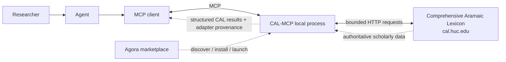
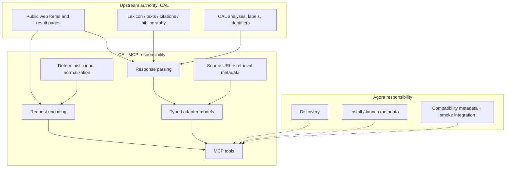
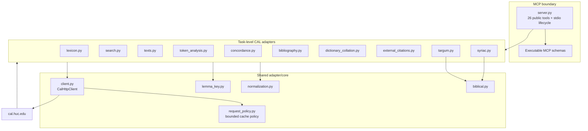
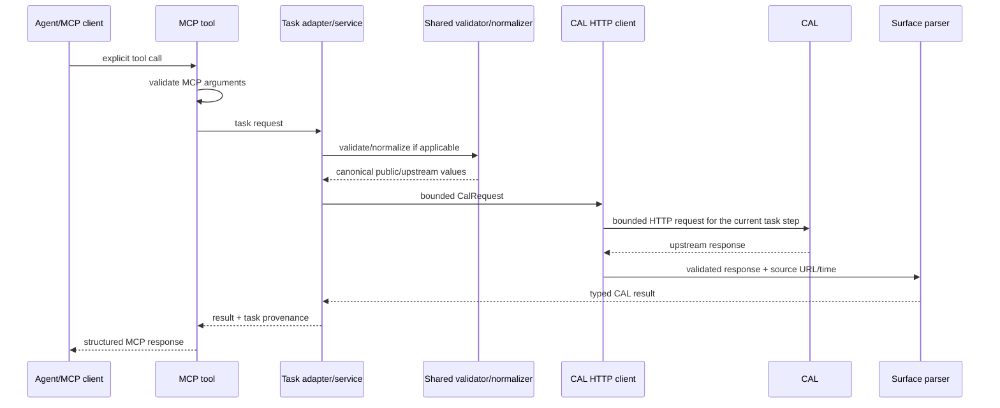
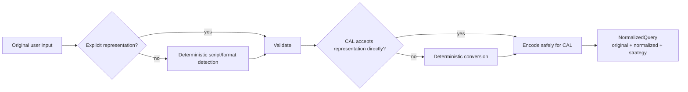
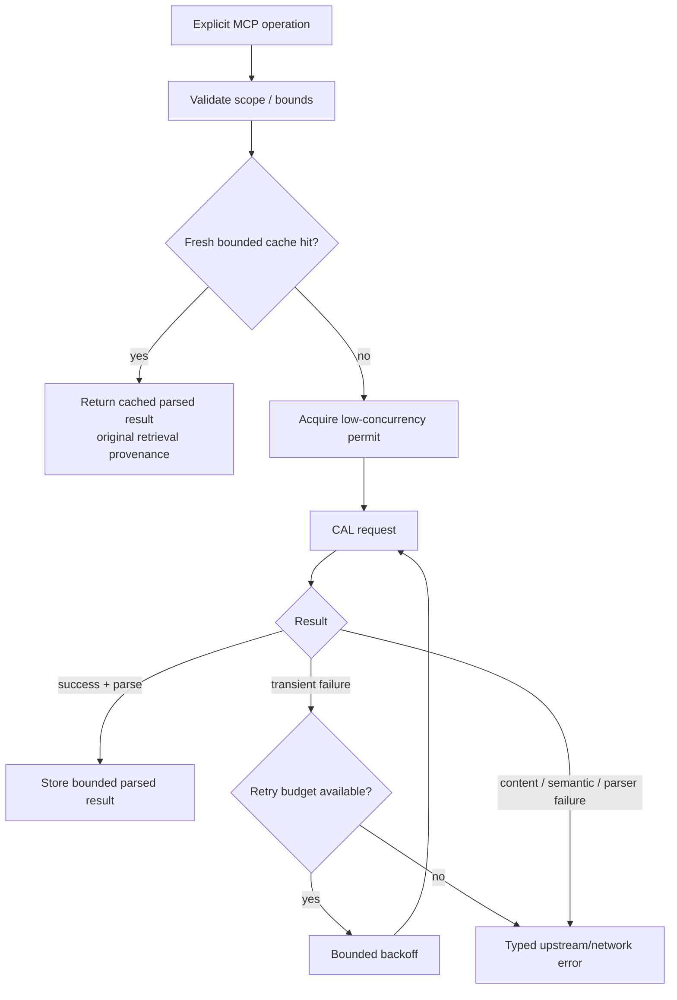
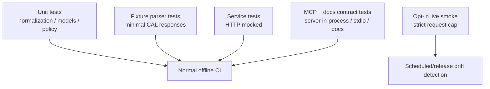
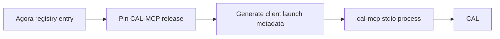

# Architecture

## 1. Architectural objective

CAL-MCP is a local, read-only MCP adapter over the Comprehensive Aramaic Lexicon's existing public research interfaces. It should make CAL easier for agents to query while preserving upstream semantics, identifiers, and provenance.

The design optimizes for five properties:

1. **Standalone operation** — the server runs as a normal MCP package without Agora.
2. **Thin upstream behavior** — no local CAL database, no scholarly reinterpretation, no hidden enrichment.
3. **Stable MCP contract** — CAL HTML and form details remain private adapter implementation details.
4. **Low upstream load** — user-triggered bounded queries, conservative concurrency/retries/cache.
5. **Recoverability** — fixtures, decisions, docs, and issues let another agent resume work without prior conversation context.

## 2. System context



Agora is outside the runtime dependency chain. An Agora-installed CAL-MCP process and a manually installed CAL-MCP process execute the same server.

## 3. Trust and ownership boundaries



### CAL owns

- textual and lexical data;
- lexical analyses, glosses, senses, dialect labels, citations, text coordinates;
- bibliography and specialist Targum/Syriac content;
- changes/corrections to CAL itself.

### CAL-MCP owns

- deterministic query normalization/encoding;
- conservative HTTP behavior;
- mapping CAL responses into typed, loss-aware adapter models;
- MCP tool schemas and composition;
- provenance metadata added by the adapter;
- user-facing documentation for the MCP;
- parser drift detection and error reporting.

### Agora owns

- marketplace discovery and description;
- installation and process launch metadata;
- client compatibility metadata;
- smoke-level proof that the released server can be reached.

CAL parsing, linguistic behavior, and CAL-specific usage guidance must not migrate into Agora merely for convenience.

## 4. Component architecture

The v0.1 implementation intentionally remains a small flat Python package. Each coherent CAL research surface owns its typed models, parsing, validation, and service behavior in one focused module; common transport/request policy and normalization are shared. This is simpler than the earlier planned `models/` / `parsers/` / `services/` directory split and has proven sufficient at the current scale.



### 4.1 MCP boundary

Responsibilities:

- declare tool names, descriptions, arguments, output schemas;
- validate caller input before network access where the public tool type/schema can do so;
- dispatch each tool to one coherent task-level adapter/service;
- own the lifespan of one bounded `CalHttpClient` for the running server so cache and single-flight state are shared across tool calls; client construction performs no CAL request and shutdown closes it;
- remain unaware of CAL selectors, table layout, HTML nesting, or endpoint-specific parsing details.

The executable MCP schemas and contract tests are the technical source of truth for the 26-tool v0.1 surface.

### 4.2 Task-level adapter modules

Modules correspond to coherent CAL research tasks, not individual PHP pages. A module may contain its own small parser, typed result/provenance classes, local validation, and service class when keeping those pieces together makes the upstream contract easier to review.

Current task modules cover:

- lexicon lookup;
- English gloss/citation-text search;
- online text discovery/page reading;
- token-at-coordinate lexical analysis;
- concordance/KWIC;
- bibliography;
- dictionary spelling collation;
- cited-but-not-online external citations;
- Targum Studies;
- Syriac Studies.

Composition across modules is explicit. For example, reading a text and analysing a token is two caller-controlled tool calls; Targum single-source browsing reuses the general text surface instead of adding another hidden browser.

### 4.3 Shared domain/validation code

Shared modules contain behavior that truly spans research surfaces:

- `normalization.py` — deterministic representation detection/conversion for supported inputs;
- `lemma_key.py` — reusable structural CAL lemma-key validation;
- `biblical.py` — bounded shared biblical coordinate validation/helpers used by specialist comparison surfaces;
- `client.py` — CAL request validation, transport, bounded retry/content policy, provenance-bearing fetch results, single-flight coordination;
- `request_policy.py` — bounded process-local completed-result cache primitives.

The shared layer contains no CAL scholarly reinterpretation and does not invent a universal result model when different CAL tasks expose different semantics.

### 4.4 CAL web anti-corruption boundary

The task modules plus `CalHttpClient` form the anti-corruption layer around undocumented upstream web interfaces. Together they own:

- URL/form parameter construction;
- percent encoding and script-safe requests;
- response content-type/status/size validation;
- maintenance/error-page detection;
- endpoint/surface-specific parsers;
- conversion to typed task models;
- fail-closed parser drift handling;
- conservative request policy.

No public MCP caller should need to know that a capability currently comes from `cal_entry_web.php`, `getlex.php`, or another specific CAL handler.

## 5. Request flow



Some user workflows require a second explicit tool call using an identifier returned by the first. The server does not turn those compositions into hidden traversals.

Failure at any layer remains distinguishable:

- invalid caller input;
- unsupported/local normalization;
- network timeout/failure;
- upstream HTTP failure;
- unsafe/oversized content;
- CAL explicit not-found/empty result;
- parser schema mismatch/upstream drift.

Do not collapse these into a generic “no result.”

## 6. Input normalization architecture

Normalization has two purposes:

1. make common user inputs accepted safely by CAL;
2. stop agents from manually inventing CAL ASCII/query syntax.



Rules:

- preserve the original input;
- prefer a representation CAL already accepts directly;
- make lossy/ambiguous conversion explicit;
- never ask an LLM to normalize/query CAL;
- do not silently choose among multiple linguistic analyses.

Not every public tool uses the lexical normalization pipeline; opaque CAL IDs, source abbreviations, dictionary selectors, and biblical coordinates have their own narrow structural validators.

## 7. Response models and provenance

Different CAL tasks expose different semantic fields, so v0.1 does **not** force every result through one universal provenance dataclass. The stable cross-surface guarantee is semantic:

- successful CAL-backed network results identify `source` as CAL;
- `source_url` records the actual upstream result URL;
- `retrieved_at` records the timezone-aware actual CAL retrieval time;
- relevant original/submitted query or CAL identifiers are preserved when useful for reproducibility;
- cache reuse preserves the original CAL retrieval timestamp rather than fabricating a new one.

Task modules add provenance fields appropriate to their operation (for example dictionary source/page, bibliography mode, text identifiers, or biblical coordinates). Those task-specific fields need not be identical merely for aesthetic uniformity.

### Loss-awareness

If CAL exposes information the typed model does not yet represent, the parser must not silently discard material semantic fields. The correct response depends on scope:

- extend the task model when the field is necessary for faithful semantics;
- preserve a bounded raw label/value field where appropriate;
- keep nullable fields when CAL genuinely omits optional material;
- fail the parser when dropping or guessing the field would make the result misleading.

## 8. Request policy

Default behavior until an explicit CAL machine-access policy exists:



The cache and in-flight single-flight map belong to the lifespan-managed client shared by one running MCP server. They suppress duplicate requests across tool calls in that process/session and disappear when the server stops.

### Constraints

- no corpus-wide queues;
- no “warm the cache” operation;
- no automatic enumeration of all lemmas/texts/sources;
- no unbounded pagination or CAL `show all` exposure;
- no high parallelism across CAL requests;
- retries only for explicitly classified transient failures;
- cache has size/TTL bounds and a complete disable mode;
- no persistent cache/background refresh in v0.1.

## 9. Current source layout

The current implementation is intentionally flat and reviewable:

```text
src/cal_mcp/
├── __init__.py
├── __main__.py
├── biblical.py
├── bibliography.py
├── client.py
├── concordance.py
├── dictionary_collation.py
├── external_citations.py
├── lemma_key.py
├── lexicon.py
├── normalization.py
├── request_policy.py
├── search.py
├── server.py
├── syriac.py
├── targum.py
├── texts.py
└── token_analysis.py
```

`py.typed` marks the installed package as typed.

The earlier design considered separate `models/`, `parsers/`, and `services/` subpackages. The v0.1 implementation did not need that split: focused surface modules keep parser/model/service contracts together, while genuinely shared policy remains in small shared modules. A future structural split should be driven by demonstrated maintenance pressure, not by the old aspirational tree.

## 10. Testing architecture



Normal CI is deterministic and offline. Reduced fixtures preserve only the CAL semantics needed by parser regressions. Live smoke belongs to release/drift detection and has a separate strict request budget.

See `testing.md`.

## 11. Standalone and Agora packaging

### Standalone

The package already declares `cal-mcp = "cal_mcp.server:main"` and supports `python -m cal_mcp` as equivalent local stdio entry points. Issue #15 owns publication/clean-install validation for the versioned v0.1 release; standalone source/development operation exists before that release.

### Agora

After a standalone release:



Agora should not vendor CAL-MCP source or contain CAL-specific parsers. Its test should be a representative smoke operation proving the integration can launch and reach the upstream service. Issue #16 owns that downstream registration.

## 12. Evolution rules

The 26-tool public surface audited for issue #12 is frozen for v0.1 except release-blocking fixes proven by regression tests.

A public tool/schema change requires:

1. an issue stating compatibility impact;
2. tests first;
3. user-facing documentation update;
4. architecture/decision update when semantics or boundaries change;
5. release-note entry once releases exist.

A newly discovered CAL convenience surface does not automatically expand the release contract; for example, CAL's recent-bibliography snapshot is tracked separately in issue #39.

An upstream CAL markup change that can be absorbed inside a parser should not force an MCP contract change.