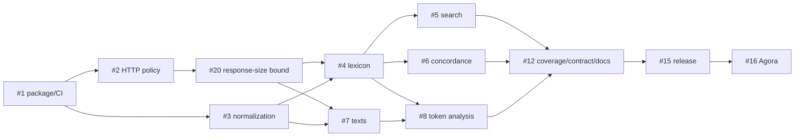

# Backlog

**Snapshot:** 2026-09-04

GitHub issues are the execution source of truth. This file records sequencing, critical path, and release scope; it should not duplicate day-to-day issue discussion.

## Priority model

- **P0 — foundation / critical path:** required before useful CAL tools can be implemented safely.
- **P1 — core research surface:** required for a practically useful CAL MCP.
- **P2 — full CAL public-surface coverage:** additional current CAL research tools/modules required for the planned v0.1 capability audit.
- **P3 — contract/release/integration:** freeze, package, live drift checks, and Agora registration.

## Ticket table

| Priority | Issue | Work | Depends on |
| --- | --- | --- | --- |
| P0 | [#1](https://github.com/alexsosn/CAL-MCP/issues/1) | Bootstrap Python package, MCP shell, CI, tooling | — |
| P0 | [#2](https://github.com/alexsosn/CAL-MCP/issues/2) | CAL HTTP client and conservative request policy | #1 |
| P0 | [#3](https://github.com/alexsosn/CAL-MCP/issues/3) | Deterministic input normalization/query encoding | #1 |
| P0 | [#20](https://github.com/alexsosn/CAL-MCP/issues/20) | Bound streamed CAL response bytes before public tools | #2 |
| P1 | [#4](https://github.com/alexsosn/CAL-MCP/issues/4) | Lexicon lookup and complete entry parsing | #2, #3; #20 safety gate |
| P1 | [#5](https://github.com/alexsosn/CAL-MCP/issues/5) | English gloss and citation-text search | #4 |
| P1 | [#6](https://github.com/alexsosn/CAL-MCP/issues/6) | Concordance/KWIC | #4 |
| P1 | [#7](https://github.com/alexsosn/CAL-MCP/issues/7) | Text catalogue/search and passage/context retrieval | #2, #3; #20 safety gate |
| P1 | [#8](https://github.com/alexsosn/CAL-MCP/issues/8) | Token-at-coordinate lexical analysis | #4, #7 |
| P2 | [#9](https://github.com/alexsosn/CAL-MCP/issues/9) | Bibliographic search | #2; #20 safety gate |
| P2 | [#10](https://github.com/alexsosn/CAL-MCP/issues/10) | Targum Studies module | #4, #7 |
| P2 | [#11](https://github.com/alexsosn/CAL-MCP/issues/11) | Syriac Studies module | #4, #7 |
| P2 | [#13](https://github.com/alexsosn/CAL-MCP/issues/13) | Citations from texts outside online corpus | #2; #20 safety gate; reuse #4/#5 models |
| P2 | [#14](https://github.com/alexsosn/CAL-MCP/issues/14) | Dictionary Spelling Collation | #2, #3; #20 safety gate; reuse #4 models |
| P3 | [#12](https://github.com/alexsosn/CAL-MCP/issues/12) | CAL capability audit + public contract/docs freeze | #5, #6, #8, #9, #10, #11, #13, #14 |
| P3 | [#15](https://github.com/alexsosn/CAL-MCP/issues/15) | v0.1 standalone release + low-load live drift smoke | #12 and all included v0.1 surfaces |
| P3 | [#16](https://github.com/alexsosn/CAL-MCP/issues/16) | Register released CAL-MCP with Agora | #15 |

## Critical path

P2 specialist work can run in parallel after its prerequisites, but no CAL-backed public tool may bypass #20's response-size safety gate. All current CAL public research functions must be accounted for at #12.

## Parallel work lanes

Once #1 is merged:

- **Infrastructure lane:** #2 → #20
- **Normalization lane:** #3

Once #2/#3/#20 are merged:

- **Lexical lane:** #4 → #5/#6
- **Text lane:** #7 → #8
- **Bibliography lane:** #9
- **Dictionary collation lane:** #14
- **External-citation lane:** #13 (prefer after shared citation models exist)

Once #4/#7 are merged:

- **Targum lane:** #10
- **Syriac lane:** #11

Agents may work on independent lanes concurrently only when there is no overlapping active PR or shared schema redesign in flight.

## v0.1 capability gate

Issue #12 must build a dated matrix from CAL's then-current public interfaces. At minimum, the audit must check:

- lexicon browsing/lookup by CAL-supported forms;
- English gloss search;
- English/citation-content search;
- citations from texts outside the online corpus;
- text browse/search;
- single-text concordance;
- multi-text/dialect KWIC;
- token lexical analysis from CAL text context;
- bibliographic archives/search;
- Dictionary Spelling Collation;
- Targum Studies Module;
- Syriac Studies Module;
- any additional public research function visible in CAL's current search page/new-user guide/modules on the audit date.

For every item the matrix records one state:

- **implemented** — directly exposed by released/planned MCP tools;
- **composed** — faithfully achievable by combining existing MCP tools without hidden bulk requests;
- **deferred** — intentionally omitted with a reviewed decision, rationale, and user-facing limitation;
- **gap** — must become a blocking focused issue before v0.1 freeze.

## Release gates

### Gate A — Core usable MCP

Reached when #4, #6, #7, and #8 provide a coherent lexical/text/concordance workflow with provenance and offline tests. #20 must already be merged before those public tools are enabled.

### Gate B — Public CAL coverage accounted for

Reached only when #12's capability matrix has no unexplained gaps.

### Gate C — Standalone v0.1

Reached only when #15 proves:

- clean install;
- stable stdio launch;
- offline deterministic CI;
- strict low-load live drift checks;
- documentation matches executable schemas;
- no CAL data is bundled.

### Gate D — Agora integration

#16 begins only after Gate C. Agora should pin the standalone release and own only discovery/install/launch/compatibility metadata plus smoke-level integration verification.

## Backlog hygiene

- New upstream CAL surface discovered before #12: create a focused issue and add it here if it affects v0.1 sequencing.
- New idea that extends CAL rather than exposes existing CAL behavior: default to post-v0.1 and keep it clearly adapter-owned; never present it as CAL semantics.
- Upstream CAL scholarly bug: report/document upstream; do not create an MCP “fix CAL” ticket.
- Upstream markup drift: parser regression issue, normally without public MCP schema change.
- Agora-only integration issue: belongs downstream in Agora once CAL-MCP has a release to consume.
