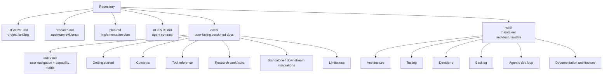
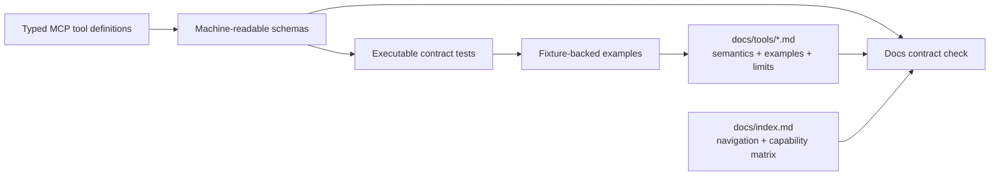

# Documentation architecture

Documentation is part of the product contract. CAL-MCP serves two audiences with different needs:

1. **research users and agents using the released MCP**;
2. **maintainers/coding agents changing CAL-MCP**.

These audiences must not share one undifferentiated documentation tree.

## 1. Information architecture



### Root documents

**`README.md`**

- 5-minute orientation;
- status, goals, non-goals;
- minimal architecture diagrams;
- prominent link into `docs/index.md` for user documentation;
- CAL/Agora relationship and disclaimer;
- must stay short enough to remain a landing page rather than becoming a second documentation site.

**`research.md`**

- dated evidence, not polished user guidance;
- exact upstream URLs and observed behavior;
- access-policy findings;
- prior art;
- open research questions;
- append/amend when evidence changes.

Focused issue research may live in `docs/research/` when the evidence set is large enough to deserve its own reviewable artifact.

**`plan.md`**

- staged work and dependency graph;
- release gates;
- explicit documentation workstream;
- updated when sequencing or release scope changes, not for every implementation detail.

Focused issue plans may live in `docs/plans/` when a ticket needs a frozen execution contract before TDD begins.

**`AGENTS.md`**

- mandatory contributor invariants;
- read order;
- definition of done;
- no broad design exposition that belongs in the wiki.

## 2. User-facing `docs/` v0.1 tree

The user tree is introduced only when behavior exists. The v0.1 contract is:

```text
docs/
├── index.md
├── getting-started.md
├── installation.md
├── configuration.md
├── concepts/
│   ├── cal-identifiers.md
│   ├── input-and-transliteration.md
│   ├── provenance-and-citation.md
│   └── errors-and-upstream-drift.md
├── tools/
│   ├── lexicon.md
│   ├── search.md
│   ├── concordance.md
│   ├── texts.md
│   ├── token-analysis.md
│   ├── bibliography.md
│   ├── dictionary-collation.md
│   ├── external-citations.md
│   ├── targum.md
│   └── syriac.md
├── guides/
│   ├── lexical-research.md
│   ├── corpus-context.md
│   └── reproducible-citations.md
├── integrations/
│   └── standalone-mcp.md
└── limitations.md
```

`docs/integrations/agora.md` is **not** part of the pre-registration v0.1 documentation contract. Issue #16 adds it only after a released CAL-MCP version has actually been registered downstream. User docs must never claim an integration merely because it is planned.

Do not create empty placeholder pages merely to satisfy a desired tree. A page is added only when the behavior or integration it documents exists.

## 3. Documentation ownership by layer

| Information | Owner/source of truth | Human presentation |
| --- | --- | --- |
| Tool names/arguments/output schema | executable MCP code/schema | `docs/tools/*` + `docs/index.md` navigation |
| CAL semantics/content | CAL | links + faithful explanation in relevant docs |
| CAL endpoint/form details | adapter implementation + research evidence | normally hidden from user docs |
| Input normalization behavior | normalization code/tests | `docs/concepts/input-and-transliteration.md` |
| Common provenance guarantees | typed results/tests | `docs/concepts/provenance-and-citation.md` |
| Error/empty/drift semantics | client + surface parser tests | `docs/concepts/errors-and-upstream-drift.md` |
| Installation command | package metadata/release state | `docs/installation.md` |
| Runtime config | config schema/code | `docs/configuration.md` |
| Architecture | `wiki/architecture.md` | README summary only |
| Durable project decisions | `wiki/decisions.md` | linked where relevant |
| Agora launch metadata | Agora registry after release | `docs/integrations/agora.md` only after downstream registration |
| Upstream evidence | `research.md` / focused issue research | synthesized, not copied, into user docs |

## 4. Tool-reference architecture

Tool reference must not become a second hand-maintained schema.

Current model:



The offline docs-contract test checks that every executable public tool is explicitly named in tool reference, every tool page is reachable from the user index, required v0.1 entry points exist, and relative README/docs links resolve.

For each tool page, document:

- research purpose;
- when to use it versus adjacent tools;
- arguments in human terms;
- CAL terminology preserved by the result;
- result semantics and provenance;
- limits/pagination;
- representative examples verified by tests or bounded research fixtures;
- upstream-dependent failure modes;
- explicit non-capabilities.

Do not paste generated JSON schema verbatim if it can be inspected mechanically. Human docs should add semantics, selection guidance, and composition rules rather than duplicate syntax.

## 5. Example policy

Examples are part of testing.

Every user-visible CAL-data example should be one of:

1. a deterministic example backed by a reduced test fixture; or
2. a live example captured by an opt-in smoke/research check and clearly identified as upstream-live/subject to CAL updates.

Examples must not imply that CAL data are bundled locally. They should expose retrieval/provenance behavior where relevant.

When CAL changes an answer, update the live example only after confirming the adapter remains semantically correct.

Generic command/process examples such as `cal-mcp` are grounded in package metadata and launch tests rather than CAL fixtures.

## 6. Documentation build strategy

### Stage A — bootstrap (completed)

Version-control Markdown only. Mermaid diagrams render directly on GitHub. No documentation framework was introduced before user-facing pages existed.

### Stage B — implemented v0.1 user documentation (current)

Maintain navigation-ready Markdown with an offline executable docs contract:

- required user entry points;
- relative-link validation;
- public-tool-name coverage;
- tool-page navigation from `docs/index.md`;
- examples tied to existing fixtures/tests where practical.

This is sufficient for the pre-release v0.1 contract and keeps documentation reviewable directly on GitHub.

### Stage C — optional documentation site

Choose a static documentation renderer only when publication/versioning needs justify another dependency. Selection criteria:

- builds from the same Markdown files viewed on GitHub;
- supports Mermaid without bespoke diagram duplication;
- supports stable versioned URLs or release snapshots;
- does not require a JavaScript application for basic reading;
- easy deterministic CI build;
- no dependency on Agora.

A future implementation ticket should evaluate the then-current documentation ecosystem rather than retroactively locking v0.1 to a framework.

### Stage D — release and downstream integration

Issue #15 updates published-release documentation with:

- clean-install instructions;
- exact package/version/entry point;
- release notes/changelog;
- low-load live-smoke contributor guidance.

Issue #16, only after release, adds:

- optional Agora discovery/install path;
- downstream registry/version pin details;
- client/platform constraints learned from actual integration.

## 7. Architecture-diagram policy

Diagrams are source code in Markdown using Mermaid.

Rules:

- keep diagrams near the prose they explain;
- do not commit raster exports as the source of truth;
- update a diagram in the same PR as a boundary/data-flow change;
- prefer several focused diagrams over one unreadable global graph;
- user docs show interaction/workflow guidance; maintainer wiki shows internal component diagrams.

Required architecture views at the v0.1 release boundary:

- system context / CAL / CAL-MCP / Agora boundary;
- actual internal component architecture;
- request sequence;
- normalization flow;
- request-policy flow;
- test architecture;
- documentation architecture;
- downstream Agora integration flow once issue #16 exists.

## 8. Update triggers

A PR must update docs when it changes any of the following:

| Change | Required docs |
| --- | --- |
| new MCP tool | tool page + index/navigation + example |
| tool argument/result change | tool page + compatibility/release note |
| normalization rule | input/transliteration page + tests |
| provenance schema/guarantee | provenance/citation page |
| error semantics | errors/upstream-drift page |
| package/launch command | installation/standalone docs |
| configuration option | configuration docs |
| architecture boundary/layout | `wiki/architecture.md` + decision if durable |
| CAL behavior assumption | research evidence; decision if architecture changes |
| Agora integration | `docs/integrations/agora.md` only after downstream registration |

## 9. Documentation acceptance criteria for feature tickets

A feature ticket is not done until:

- its public behavior is documented;
- examples correspond to tested/researched behavior;
- CAL terminology/limitations are stated accurately;
- source/provenance behavior is shown when meaningful;
- adjacent-tool guidance prevents agents from choosing a broader/more expensive tool unnecessarily;
- the user index/navigation includes the new page/tool;
- no aspirational/unimplemented capability is presented as available.

## 10. Documentation review checklist

A logically independent review asks:

- Does the page describe what the executable code does now?
- Could an agent select the correct/narrowest tool from the description alone?
- Are CAL facts distinguished from CAL-MCP adapter behavior?
- Are input representations and ambiguities explicit?
- Are result limits and network/upstream dependencies explicit?
- Are multi-stage workflows caller-controlled rather than disguised hidden traversal?
- Can the example be traced to a test fixture/research observation or package metadata?
- Are cross-links valid?
- Did a diagram become stale?
- Does installation text distinguish source/pre-release state from a published package?
- Does the PR accidentally claim an Agora integration before #16 or move CAL-specific documentation into Agora?
