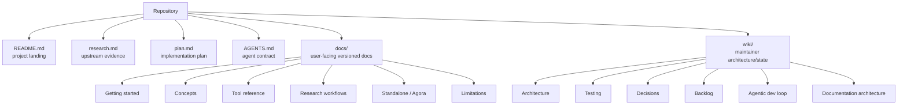
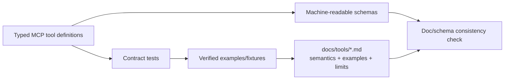

# Documentation architecture

Documentation is part of the product contract. CAL-MCP serves two audiences with different needs:

1. **research users and agents using the released MCP**;
2. **maintainers/coding agents changing CAL-MCP**.

These audiences must not share one undifferentiated documentation tree.

## 1. Information architecture



### Root documents

**`README.md`**

- 5-minute orientation;
- status, goals, non-goals;
- minimal architecture diagrams;
- links to installation/docs once implementation exists;
- CAL/Agora relationship and disclaimer;
- must stay short enough to remain a landing page.

**`research.md`**

- dated evidence, not polished user guidance;
- exact upstream URLs and observed behavior;
- access-policy findings;
- prior art;
- open research questions;
- append/amend when evidence changes.

**`plan.md`**

- staged work and dependency graph;
- release gates;
- explicit documentation workstream;
- updated when sequencing or release scope changes, not for every implementation detail.

**`AGENTS.md`**

- mandatory contributor invariants;
- read order;
- definition of done;
- no broad design exposition that belongs in the wiki.

## 2. User-facing `docs/` target tree

The `docs/` tree is introduced incrementally with implemented behavior. At v0.1 it should be:

```text
docs/
├── index.md
├── getting-started.md
├── installation.md
├── configuration.md
├── concepts/
│   ├── cal-identifiers.md
│   ├── input-and-transliteration.md
│   ├── provenance-and-citation.md
│   └── errors-and-upstream-drift.md
├── tools/
│   ├── lexicon.md
│   ├── search.md
│   ├── concordance.md
│   ├── texts.md
│   ├── token-analysis.md
│   ├── bibliography.md
│   ├── targum.md
│   └── syriac.md
├── guides/
│   ├── lexical-research.md
│   ├── corpus-context.md
│   └── reproducible-citations.md
├── integrations/
│   ├── standalone-mcp.md
│   └── agora.md
└── limitations.md
```

Do not create empty placeholder pages merely to satisfy this tree. A page is added in the PR that implements the capability it documents.

## 3. Documentation ownership by layer

| Information | Owner/source of truth | Human presentation |
| --- | --- | --- |
| Tool names/arguments/output schema | executable MCP code/schema | `docs/tools/*` |
| CAL semantics/content | CAL | links + faithful explanation in relevant docs |
| CAL endpoint/form details | adapter implementation + `research.md` | normally hidden from user docs |
| Input normalization behavior | normalization code/tests | `docs/concepts/input-and-transliteration.md` |
| Provenance fields | typed schema/tests | `docs/concepts/provenance-and-citation.md` |
| Installation command | package metadata/release | `docs/installation.md` |
| Runtime config | config schema/code | `docs/configuration.md` |
| Architecture | `wiki/architecture.md` | README summary only |
| Durable project decisions | `wiki/decisions.md` | linked where relevant |
| Agora launch metadata | Agora registry after release | `docs/integrations/agora.md` explains expected integration |
| Upstream evidence | `research.md` | synthesized, not copied, into user docs |

## 4. Tool-reference architecture

Tool reference should not become a second hand-maintained schema.

Preferred model:



For each tool page, document:

- research purpose;
- when to use it versus adjacent tools;
- arguments in human terms;
- CAL terminology preserved by the result;
- result semantics and provenance;
- limits/pagination;
- representative examples verified by tests or live smoke fixtures;
- upstream-dependent failure modes;
- explicit non-capabilities.

Do not paste generated JSON schema verbatim if it can be linked/rendered mechanically. Human docs should add semantics, not duplicate syntax.

## 5. Example policy

Examples are part of testing.

Every user-visible example should be one of:

1. a deterministic example backed by a test fixture; or
2. a live example captured by an opt-in smoke test and clearly identified as upstream-live/subject to CAL updates.

Examples must not imply that CAL data are bundled locally. They should expose retrieval/provenance behavior where relevant.

When CAL changes an answer, update the live example only after confirming the adapter remains semantically correct.

## 6. Documentation build strategy

### Stage A — bootstrap (current)

Version-control Markdown only. Mermaid diagrams render directly on GitHub. Avoid introducing a documentation framework before user-facing pages exist.

### Stage B — first implemented tools

Add `docs/` with navigation-ready Markdown. Establish a lightweight docs check in CI:

- internal-link validation;
- Markdown lint/format rules with limited, documented exceptions;
- tool-name/schema consistency check;
- code snippets/examples exercised by tests where practical.

### Stage C — v0.1 documentation site

Choose a static documentation renderer only when the `docs/` tree is substantial enough to benefit. Selection criteria:

- builds from the same Markdown files viewed on GitHub;
- supports Mermaid without bespoke diagram duplication;
- supports stable versioned URLs or release snapshots;
- does not require a JavaScript application for basic reading;
- easy deterministic CI build;
- no dependency on Agora.

The implementation ticket should evaluate the current Python-doc ecosystem before choosing/pinning a generator rather than locking one in during planning.

### Stage D — release integration

Published release docs should contain:

- clean-install instructions;
- exact package/version/entry point;
- standalone client configuration;
- optional Agora discovery/install path;
- support/limitations and upstream dependency notes;
- changelog/release notes.

## 7. Architecture-diagram policy

Diagrams are source code in Markdown using Mermaid.

Rules:

- keep diagrams near the prose they explain;
- do not commit raster exports as the source of truth;
- update the diagram in the same PR as a boundary/data-flow change;
- prefer several focused diagrams over one unreadable global graph;
- user docs show interaction diagrams; maintainer wiki shows internal component diagrams.

Required diagrams at v0.1:

- system context / CAL / CAL-MCP / Agora boundary;
- internal component architecture;
- request sequence;
- normalization flow;
- request-policy flow;
- test architecture;
- documentation architecture;
- Agora integration flow.

## 8. Update triggers

A PR must update docs when it changes any of the following:

| Change | Required docs |
| --- | --- |
| new MCP tool | tool page + index/navigation + example |
| tool argument/result change | tool page + compatibility/release note |
| normalization rule | input/transliteration page + tests |
| provenance schema | provenance/citation page |
| error semantics | errors/upstream-drift page |
| package/launch command | installation/standalone docs |
| configuration option | configuration docs |
| architecture boundary | `wiki/architecture.md` + decision if durable |
| CAL behavior assumption | `research.md`; decision if architecture changes |
| Agora integration | `docs/integrations/agora.md` after downstream registration |

## 9. Documentation acceptance criteria for feature tickets

A feature ticket is not done until:

- its public behavior is documented;
- examples correspond to tested behavior;
- CAL terminology/limitations are stated accurately;
- source/provenance behavior is shown when meaningful;
- adjacent-tool guidance prevents agents from choosing a broader/more expensive tool unnecessarily;
- no aspirational/unimplemented capability is presented as available.

## 10. Documentation review checklist

Independent review asks:

- Does the page describe what the released code does now?
- Could an agent select the correct tool from the description alone?
- Are CAL facts distinguished from CAL-MCP adapter behavior?
- Are input representations and ambiguities explicit?
- Are result limits and network/upstream dependencies explicit?
- Can the example be reproduced?
- Are cross-links valid?
- Did a diagram become stale?
- Did the PR accidentally move CAL-specific documentation into Agora instead of keeping it upstream here?
