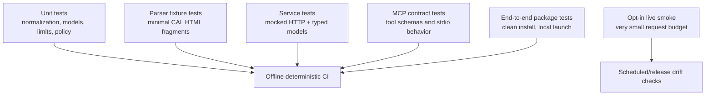

# Testing strategy

CAL-MCP adapts a live scholarly website with undocumented machine interfaces. Tests must prove our adapter contract without turning CI into a crawler or making correctness depend on CAL availability.

## 1. Test pyramid



Normal CI must pass with outbound CAL access unavailable.

## 2. TDD rule

For behavior changes:

1. identify the observable contract and failure mode;
2. add a failing test or minimal upstream fixture;
3. verify the test fails for the intended reason;
4. implement the smallest correct change;
5. refactor without changing the contract;
6. update docs/examples in the same PR.

A parser implementation written before a representative fixture/test is not considered complete.

## 3. Fixture policy

Fixtures exist to test parsing, not to archive CAL.

Each real-upstream fixture must:

- contain only the minimum HTML/response fragment needed for the test;
- record the source URL and capture date in adjacent fixture metadata or test comments;
- remove unrelated lexical/text content where doing so does not alter parser structure;
- avoid full entries/pages when a small structural excerpt is sufficient;
- never accumulate through bulk capture;
- be reviewed for whether the fragment is actually needed.

Synthetic fixtures are preferred for malformed/error cases.

Suggested layout once implementation begins:

```text
tests/
├── fixtures/
│   ├── lexicon/
│   ├── texts/
│   ├── concordance/
│   ├── bibliography/
│   ├── targum/
│   └── syriac/
├── unit/
├── parsers/
├── services/
├── mcp/
└── live/
```

## 4. Parser contract tests

Every endpoint parser should cover, where applicable:

- representative successful result;
- empty/not-found response;
- multiple results/analyses;
- missing optional element;
- changed/missing required semantic element;
- Unicode Hebrew/Syriac/transliteration content;
- upstream error/maintenance page masquerading as HTTP 200;
- unexpected content type or malformed HTML;
- pagination/next-page information;
- source links/identifiers needed for provenance.

Parsers should fail loudly when a structural change risks returning misleading data.

## 5. Normalization tests

Normalization is deterministic and must have high-coverage table-driven tests.

Test categories:

- CAL transliteration accepted unchanged when appropriate;
- Hebrew square script;
- Syriac script;
- Unicode scholarly transliteration supported by the project;
- punctuation/whitespace normalization;
- URL/form encoding;
- explicit representation override;
- ambiguous/unsupported characters;
- original input preserved exactly;
- conversions marked as lossless/lossy/unsupported as appropriate.

Do not test LLM-generated normalization because no LLM belongs in this layer.

## 6. HTTP/request-policy tests

Tests must prove bounded behavior, including:

- finite timeouts are configured;
- retry only on whitelisted transient failures;
- retry count is capped;
- backoff is bounded;
- semantic 4xx/upstream application errors are not blindly retried;
- concurrency gate is enforced;
- cache has TTL/size bounds;
- cache can be disabled;
- no request is made on validation failure;
- no hidden prefetch is triggered by a single tool call;
- pagination cannot run unbounded without explicit caller continuation.

Use a mock transport/local fake server. Do not use CAL for these tests.

## 7. Service tests

Service tests mock the HTTP adapter and verify orchestration:

- normalization happens before request construction;
- correct parser selected for upstream surface;
- provenance is attached consistently;
- limits propagate correctly;
- multiple upstream calls occur only when the explicit research operation requires them;
- one failure does not silently become an empty result;
- CAL data and adapter-generated metadata remain distinguishable.

## 8. MCP contract tests

For every public tool:

- tool registers with the expected name/description;
- input schema validates required/optional fields;
- invalid input produces no network call;
- typed service result serializes without losing semantic fields;
- typed errors map to stable, useful MCP errors/results;
- examples in `docs/` match the current tool contract;
- server can start and answer introspection without contacting CAL.

At least one test should launch the actual stdio entry point once packaging exists.

## 9. Live smoke tests

Live tests detect upstream drift; they do not validate CAL scholarship.

Rules:

- opt-in locally and separated from normal CI;
- scheduled/release runs only after the relevant feature is stable;
- strict total request cap per run;
- no loops over lemma lists/text catalogues;
- representative queries chosen for structural stability, not exhaustive coverage;
- cache disabled or controlled so request count is explicit;
- identify CAL-MCP in requests where appropriate;
- record timestamps and distinguish upstream downtime from parser drift.

A possible v0.1 smoke budget is one representative request per major surface, but the exact number belongs in the release/live-smoke ticket and should remain intentionally small.

## 10. Data-quality boundary

Tests prove CAL-MCP faithfully represents CAL's response. They do not establish that CAL's linguistic analysis is correct.

For example:

- valid: “the parser returns both analyses shown by CAL”;
- invalid as a CAL-MCP responsibility: “the first CAL analysis is linguistically correct”;
- valid: “the dialect label is preserved exactly”;
- invalid: “this token truly belongs to that dialect.”

Potential upstream scholarly errors should be reported upstream and, if necessary, documented as an upstream limitation rather than patched silently.

## 11. Regression fixtures for upstream drift

When a live smoke detects a CAL markup change:

1. capture the smallest legal/necessary new structural fixture;
2. add a failing regression test;
3. determine whether CAL semantics changed or only markup changed;
4. update the parser without changing MCP schema when possible;
5. update `research.md` if the upstream interface assumption changed;
6. update `decisions.md` only if the architecture/contract must change.

## 12. Documentation tests

As `docs/` grows, CI should validate:

- internal Markdown links;
- Mermaid syntax/build where the chosen docs tool supports checking it;
- documented tool names exist in the server schema;
- examples are exercised by tests or generated from tested fixtures where practical;
- no page claims an unimplemented capability.

The docs framework itself should remain optional for using CAL-MCP.
