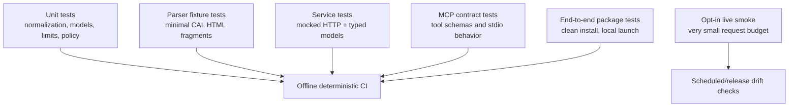

# Testing strategy

CAL-MCP adapts a live scholarly website with undocumented machine interfaces. Tests must prove our adapter contract without turning CI into a crawler or making correctness depend on CAL availability.

## 1. Test pyramid


```mermaid
flowchart TB
    U[Unit tests\nnormalization, models, limits, policy]
    P[Parser fixture tests\nminimal CAL HTML fragments]
    S[Service tests\nmocked HTTP + typed models]
    M[MCP contract tests\ntool schemas and stdio behavior]
    E[End-to-end package tests\nclean install, local launch]
    L[Opt-in live smoke\nvery small request budget]

    U --> CI[Offline deterministic CI]
    P --> CI
    S --> CI
    M --> CI
    E --> CI
    L --> LIVE[Scheduled/release drift checks]
```

Normal CI must pass with outbound CAL access unavailable.

## 2. TDD rule

For behavior changes:

1. identify the observable contract and failure mode;
2. add a failing test or minimal upstream fixture;
3. verify the test fails for the intended reason;
4. implement the smallest correct change;
5. refactor without changing the contract;
6. update docs/examples in the same PR.

A parser implementation written before a representative fixture/test is not considered complete.

## 3. Fixture policy

Fixtures exist to test parsing, not to archive CAL.

Each real-upstream fixture must:

- contain only the minimum HTML/response fragment needed for the test;
- record the source URL and capture date in adjacent fixture metadata or test comments;
- remove unrelated lexical/text content where doing so does not alter parser structure;
- avoid full entries/pages when a small structural excerpt is sufficient;
- never accumulate through bulk capture;
- be reviewed for whether the fragment is actually needed.

Synthetic fixtures are preferred for malformed/error cases.

Suggested layout once implementation begins:

```text
tests/
├── fixtures/
│   ├── lexicon/
│   ├── texts/
│   ├── concordance/
│   ├── bibliography/
│   ├── targum/
│   └── syriac/
├── unit/
├── parsers/
├── services/
├── mcp/
└── live/
```

## 4. Parser contract tests

Every endpoint parser should cover, where applicable:

- representative successful result;
- empty/not-found response;
- multiple results/analyses;
- missing optional element;
- changed/missing required semantic element;
- Unicode Hebrew/Syriac/transliteration content;
- upstream error/maintenance page masquerading as HTTP 200;
- unexpected content type or malformed HTML;
- pagination/next-page information;
- source links/identifiers needed for provenance.

Parsers should fail loudly when a structural change risks returning misleading data.

## 5. Normalization tests

Normalization is deterministic and must have high-coverage table-driven tests.

Test categories:

- CAL transliteration accepted unchanged when appropriate;
- Hebrew square script;
- Syriac script;
- Unicode scholarly transliteration supported by the project;
- punctuation/whitespace normalization;
- URL/form encoding;
- explicit representation override;
- ambiguous/unsupported characters;
- original input preserved exactly;
- conversions marked as lossless/lossy/unsupported as appropriate.

Do not test LLM-generated normalization because no LLM belongs in this layer.

## 6. HTTP/request-policy tests

Tests must prove bounded behavior, including:

- finite timeouts are configured;
- retry only on whitelisted transient failures;
- retry count is capped;
- backoff is bounded;
- semantic 4xx/upstream application errors are not blindly retried;
- concurrency gate is enforced;
- cache has TTL/size bounds;
- cache can be disabled;
- no request is made on validation failure;
- no hidden prefetch is triggered by a single tool call;
- pagination cannot run unbounded without explicit caller continuation.

Use a mock transport/local fake server. Do not use CAL for these tests.

## 7. Service tests

Service tests mock the HTTP adapter and verify orchestration:

- normalization happens before request construction;
- correct parser selected for upstream surface;
- provenance is attached consistently;
- limits propagate correctly;
- multiple upstream calls occur only when the explicit research operation requires them;
- one failure does not silently become an empty result;
- CAL data and adapter-generated metadata remain distinguishable.

## 8. MCP contract tests

For every public tool:

- tool registers with the expected name/description;
- input schema validates required/optional fields;
- invalid input produces no network call;
- typed service result serializes without losing semantic fields;
- anticipated typed CAL-MCP failures return stable structured `isError` payloads with kind, operation, retryability, honest upstream reachability, and only typed safe metadata;
- unexpected programming failures remain on the SDK's generic sanitizer and do not leak arbitrary exception text or receive a misleading CAL-MCP error kind;
- successful empty/not-found states remain successful structured results;
- every public tool output schema continues to admit the shared structured error payload;
- examples in `docs/` match the current tool contract;
- server can start and answer introspection without contacting CAL.

At least one test should launch the actual stdio entry point once packaging exists.

## 9. Live smoke tests

Live tests detect upstream drift; they do not establish CAL scholarship. Normal pull-request
CI stays offline. The installed-stdio smoke (issue #157, D-022) is intentionally opt-in:
the release-tag job runs it *before* PyPI publication, and
`.github/workflows/live-smoke.yml` runs it only on explicit dispatch or its weekly schedule.

Both workflows execute one `cal_mcp.stdio_live_smoke` suite from an installed wheel,
not the old direct-Python-service smoke in `cal_mcp.live_smoke`. The release job
downloads the exact wheel built and tested by `build-and-test` instead of
reinstalling the checkout. The weekly job builds the current checked-out wheel.
The smoke interpreter runs outside the checkout so it cannot import source files
in place of the installed wheel.

To run the same explicitly networked check yourself, first install a trusted,
locally built wheel into an isolated environment, change to a directory **outside**
the repository, and run:

```bash
python -m cal_mcp.stdio_live_smoke --executable /absolute/path/to/venv/bin/cal-mcp
```

The `python` used above must belong to that installed-wheel environment.
Importing the module or listing MCP tools does not make CAL requests; invoking
the eleven representative cases does.

The total ceiling is **25 actual CAL transport attempts per smoke invocation**,
enforced inside the server immediately before each transport call. All tools
share one process with **concurrency 1**, **retries 0**, and the normal bounded
in-memory successful-response **cache enabled** (cache hits cost zero). The
client performs sequential tool calls and never enumerates result pages,
subcorpora, lexemes, links, or pagination. No regular `cal-mcp` launch inherits
the opt-in smoke limit.

The smoke driver checks `is_error`, every advertised `outputSchema`, the
strict structured-error envelope, and the CAL source URL and timestamp on
successful CAL-backed results. It classifies each attempted case as `ok`,
`drift`, `unavailable`, or `harness`; it does not copy upstream HTML into
diagnostics. The JSON report contains per-case outcomes,
`actual_cal_transport_attempts`, and `max_cal_transport_attempts`.
A missing or malformed server attempt report is a failing harness error, never
an assumed zero. Any non-OK result fails the workflow and blocks publication.

**Release readiness gate:** the fixed current 11-case matrix must still be
measured once against live CAL from the installed wheel and accepted within the
25-attempt cap; offline CI alone is insufficient. Do not run the old nine-call
service smoke alongside the new suite or automatically retry failed live smoke.
The retained `cal_mcp.live_smoke` module has legacy offline regression tests,
but is no longer a scheduled or release operation.

## 10. Dependency resolution policy

The package metadata in `pyproject.toml` intentionally keeps reviewed compatibility ranges broad for downstream users. CI reproducibility is a separate validation concern and must not be implemented by silently narrowing those runtime or development ranges.

The primary `deterministic` CI job uses Python 3.11 with two committed constraint sets:

- `constraints/ci-py311.txt` pins the complete runtime/development target environment used for Ruff, mypy, pytest, and release validation;
- `constraints/build-py311.txt` separately pins the isolated Hatchling/editable build environment. Current pip treats build constraints separately from ordinary target constraints.

The job explicitly bootstraps its reviewed pip/setuptools versions, installs `.[dev]` through both constraint files, prints `pip freeze --all`, and runs `pip check`. It then runs `scripts/verify_ci_environment.py constraints/ci-py311.txt`, excluding only the local editable `cal-mcp` distribution and the separately exact-pinned `pip`/`setuptools` bootstrap packages. That verifier fails on any missing pin, unexpected installed distribution, or version mismatch, so adding an unlisted transitive dependency cannot silently make the supposedly deterministic environment drift.

The v0.1 release `build-and-test` job consumes the same target verifier. Its actual `python -m build` step also sets `PIP_BUILD_CONSTRAINT=constraints/build-py311.txt`, so the wheel/sdist isolated build environment is constrained separately from the already-installed validation environment.

A separate `latest-compatible` CI job intentionally does **not** use either committed project constraint file or the exact-environment verifier. It resolves `.[dev]` from the broad ranges in `pyproject.toml`, reports the exact resolution with `pip freeze --all`, runs `pip check`, and executes the same Ruff/format/mypy/pytest checks. A failure there is compatibility-drift evidence; do not make the job reproducible by accidentally applying the frozen constraint set to it.

### Refreshing the Python 3.11 constraints

Constraint refreshes must be explicit, paired, and reviewable:

1. start from a clean Python 3.11 environment and the current broad `pyproject.toml` ranges;
2. resolve/install `.[dev]` without the project constraint files and require `pip check` to pass;
3. capture the full target environment with `pip freeze --all`, excluding the local editable CAL-MCP line and handling the explicitly bootstrapped pip/setuptools versions separately;
4. resolve the isolated Hatchling build/editable closure separately, including dynamic editable requirements such as `editables`;
5. update both `constraints/ci-py311.txt` and `constraints/build-py311.txt` in the same reviewed PR;
6. run `scripts/verify_ci_environment.py constraints/ci-py311.txt --exclude cal-mcp --exclude pip --exclude setuptools` and require exact agreement with the installed deterministic environment;
7. run both the constrained `deterministic` job and the unconstrained `latest-compatible` job;
8. review the dependency/version diff and any changed transitive requirements before merge.

Automation may propose constraint updates later, but it must do so through a normal reviewable PR. It must not rewrite the committed constraint files directly on `main`.

## 11. Data-quality boundary

Tests prove CAL-MCP faithfully represents CAL's response. They do not establish that CAL's linguistic analysis is correct.

For example:

- valid: “the parser returns both analyses shown by CAL”;
- invalid as a CAL-MCP responsibility: “the first CAL analysis is linguistically correct”;
- valid: “the dialect label is preserved exactly”;
- invalid: “this token truly belongs to that dialect.”

Potential upstream scholarly errors should be reported upstream and, if necessary, documented as an upstream limitation rather than patched silently.

## 12. Regression fixtures for upstream drift

When a live smoke detects a CAL markup change:

1. capture the smallest legal/necessary new structural fixture;
2. add a failing regression test;
3. determine whether CAL semantics changed or only markup changed;
4. update the parser without changing MCP schema when possible;
5. update `research.md` if the upstream interface assumption changed;
6. update `decisions.md` only if the architecture/contract must change.

## 13. Documentation tests

As `docs/` grows, CI should validate:

- internal Markdown links;
- Mermaid syntax/build where the chosen docs tool supports checking it;
- documented tool names exist in the server schema;
- examples are exercised by tests or generated from tested fixtures where practical;
- no page claims an unimplemented capability.

The docs framework itself should remain optional for using CAL-MCP.
